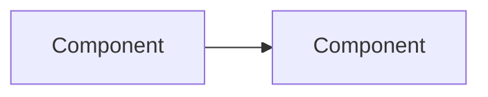

# CLAUDE.md

This file provides guidance to Claude Code (claude.ai/code) when working with code in this repository.

## [IDENTITY] Project Overview

- **Project:** Budget Analyser
- **Tech stack:** Python 3.10+, Tauri v2, React, FastAPI, pandas, SQLite, pytest
- **Type:** Cross-platform desktop application for personal finance tracking
- **Goals:** Process bank statements (CSV), categorize transactions using JSON mappings, store in SQLite, present reports via Tauri + React frontend with light/dark theme support

Budget Analyser is a personal finance tracking application that:
- Imports bank statements in CSV format (supports Citi, Discover, and custom formats)
- Categorizes transactions using keyword-based JSON mappings
- Stores transaction data in SQLite database
- Generates monthly reports with spending analysis, trends, forecasting, and budget tracking
- Provides dashboard with earnings, expenses, net worth, recurring transactions, and budget goals
- Supports payment reconciliation and transaction export (CSV, Excel, PDF)

## [WORKFLOW] Development Process

### Core Principle
**Vertical Slices First** — When adding features, create self-contained feature modules that own all layers (models + service). Do not scatter logic across horizontal layers.

### Mandatory Workflow

1. **Understand the existing code** — Budget Analyser uses a vertical slices architecture. All features live under `features/`. Check if your feature already exists.
2. **For new features:** Follow the vertical slice pattern (see "When Adding New Features" section below)
3. **Test everything:** All unit tests must pass before committing (`uv run pytest src/test/unit/ -q`)
4. **Verify imports:** Ensure no circular dependencies between features or with core

### Development Commands

```bash
# Install dependencies
uv sync --group dev

# Run the API server
uv run python -m budget_analyser

# Run the Tauri desktop app (frontend + API)
cd src/frontend && npm run tauri dev

# Run tests (REQUIRED before committing)
uv run pytest src/test/unit/ -q

# Run with coverage
uv run pytest --cov=src/budget_analyser

# Run linting
uv run pylint src/budget_analyser
```

## [ARCHITECTURE] System Design

### Architecture Overview

**Vertical feature slices architecture** — All 13 features are organized as self-contained vertical slices. Each feature owns its layers: `models.py` (DTOs + data access) and `service.py` (business logic + coordination). The frontend is a Tauri v2 + React app that communicates with the Python backend via FastAPI. Shared infrastructure lives in `core/`.

```
src/budget_analyser/
├── api/             # FastAPI REST API layer
│   ├── main.py          # App factory, CORS, router registration
│   ├── dependencies.py  # Composition root (service wiring)
│   └── routers/         # 17 route modules (auth, reports, dashboard, etc.)
├── core/            # Shared foundation (protocols, errors, DB utils, shared DTOs)
│   ├── __init__.py
│   ├── protocols.py     # Domain interfaces (StatementRepository, etc.)
│   ├── errors.py        # Domain exception hierarchy
│   ├── database.py      # Shared SQLite connection factory
│   └── models.py        # Cross-feature DTOs (MonthlyReports)
├── features/        # Vertical feature slices (13 modules)
│   ├── budget_goals/    # Budget and earnings goals management
│   │   ├── models.py        # DTOs + data access (BudgetGoalsModel)
│   │   ├── service.py       # Business logic (BudgetGoalsService)
│   │   ├── controller.py    # Backward-compat shim → service.py
│   │   └── repository.py    # Backward-compat shim → models.py
│   ├── net_worth/       # Financial accounts and net worth tracking
│   ├── recurring/       # Recurring transaction management
│   ├── savings/         # Savings metrics and tracking
│   ├── forecasting/     # Expense forecasting service
│   ├── trends/          # Spending trends and burn rate analysis
│   ├── export/          # CSV/Excel/PDF export service
│   ├── payments/        # Payment reconciliation
│   ├── reporting/       # Monthly report generation
│   ├── mappers/         # Category and cashflow mapping
│   ├── ingestion/       # CSV ingestion pipeline
│   ├── recategorize/    # Transaction recategorization
│   └── settings/        # Settings management
├── domain/          # Backward-compat shims (12 files → features/)
├── settings/        # Configuration (settings.py, preferences.py)
└── data/            # Application data (not code)
    ├── config/budget_analyser.ini   # Runtime config
    ├── mappers/*.json               # Keyword → category mappings
    ├── statements/                  # User CSV files
    └── budget_analyser.db           # SQLite database

├── frontend/        # Tauri v2 + React desktop app
│   ├── src/             # React source (TypeScript)
│   │   ├── api/hooks/   # React Query hooks for API calls
│   │   ├── components/  # Reusable UI components
│   │   └── pages/       # Page components (13 pages)
│   ├── src-tauri/       # Tauri Rust shell
│   └── package.json
```

**Key data flow:**
1. CSV files → Bank-specific formatter → Transaction processor → SQLite DB
2. SQLite DB → ReportService → MonthlyReports → FastAPI → React frontend

**Entry point:** `python -m budget_analyser` → `api.main:app` via uvicorn on port 8741

**Architecture status:**
- ✅ 13 feature modules with models.py + service.py
- ✅ FastAPI REST API layer with 17 router modules
- ✅ Tauri v2 + React frontend with 13 pages
- ✅ Backward-compat shims: 12 domain/ files, 8 feature controller.py, 4 feature repository.py
- ✅ Legacy `controller/` and `infrastructure/` directories removed
- ✅ Shared core layer with protocols, errors, database utilities
- ✅ 469 unit tests passing

**Backward compatibility:** Old imports still work via re-export shims in `domain/` and feature-level `controller.py`/`repository.py` files. Example:
```python
# OLD WAY (still works, via domain/ shim)
from budget_analyser.domain.forecasting import ForecastService

# OLD WAY (still works, via feature controller.py shim)
from budget_analyser.features.budget_goals.controller import BudgetGoalsController

# NEW WAY (preferred)
from budget_analyser.features.budget_goals.service import BudgetGoalsService
```

## Code Style & Linting

**All code must comply with PEP 8 and pylint.** Run `pylint src/budget_analyser` before committing.

Pylint configuration (`.pylintrc`):
- Max line length: 100 characters
- Max function arguments: 6
- Max local variables: 15
- Max branches: 12
- Max statements per function: 50

### Type Hints (Mandatory)

Type hints are **required** on all function and method signatures (parameters and return types).

```python
from __future__ import annotations  # Required in every module

# Use modern type syntax (Python 3.10+):
def process(self, *, raw_transactions: pd.DataFrame) -> pd.DataFrame: ...
def get_budget(self, category: str, year_month: str = "ALL") -> BudgetGoal | None: ...
def get_accounts(self) -> list[Account]: ...
def get_mappings(self) -> dict[str, list[str]]: ...

# Use collections.abc for abstract types:
from collections.abc import Callable, Mapping, Sequence
def run(self, *, formatter: Callable[[str], str]) -> Sequence[dict[str, float]]: ...
```

**Rules:**
- `from __future__ import annotations` in every module
- Use `X | None` instead of `Optional[X]`
- Use `list[x]`, `dict[k, v]`, `tuple[a, b]` instead of `List`, `Dict`, `Tuple` from `typing`
- Use `collections.abc` for `Callable`, `Mapping`, `Sequence`, `Iterable`
- Only import from `typing` when needed: `Any`, `Protocol`, `ClassVar`, `TypeVar`

### Coding Guidelines

- Prefer keyword-only arguments (`def foo(*, arg1, arg2)`) for clarity
- Keep functions focused and single-purpose
- Extract complex conditions into well-named boolean variables
- No magic numbers — use named constants
- Meaningful names over comments (code should be self-documenting)
- Functions should operate at one level of abstraction

## Documentation Standards

**All public classes, methods, and functions must have Google-style docstrings.**

```python
def calculate_burn_rate(
    *,
    transactions: pd.DataFrame,
    budget_limit: float,
    as_of_date: date | None = None,
) -> BurnRateMetrics:
    """Calculate daily spending velocity and project monthly total.

    Computes how fast the budget is being consumed based on
    spending patterns up to the given date.

    Args:
        transactions: DataFrame with 'amount' and 'transaction_date' columns.
        budget_limit: Monthly budget ceiling for the category.
        as_of_date: Date to calculate burn rate as of. Defaults to today.

    Returns:
        BurnRateMetrics with daily rate, projection, and remaining budget.

    Raises:
        ValidationError: If transactions DataFrame is missing required columns.
    """
```

**When to write docstrings:**

| Scope | Required | Notes |
|-------|----------|-------|
| Public classes | Yes | Describe purpose and usage |
| Public methods/functions | Yes | Args, Returns, Raises sections |
| Private methods (`_helper`) | Only if logic is non-obvious | Keep brief |
| Module-level | Optional | Only for complex modules |
| Test functions | No | Test name should be self-documenting |

**Google-style sections to use:**

| Section | When |
|---------|------|
| `Args:` | Function takes parameters |
| `Returns:` | Function returns a value |
| `Raises:` | Function raises exceptions |
| `Note:` | Important caveats or context |
| `Example:` | Complex or non-obvious usage |

## Versioning

- **Patch** version auto-increments on push to `main` via GitHub Actions
- **Minor/Major** versions: create Git tags manually (`git tag -a vX.Y.0 -m "..."`)
- Set `eng_ver = 0` in `pyproject.toml` during development to disable auto-increment

## Git Commits

**Use the `/git-skills` skill for all git operations.** It enforces signed commits, semantic format with scope (`type(scope): description`), file-change tables, rebase-before-commit workflow, and GitKraken MCP tools.

## Design Patterns & Modularity

**Always use appropriate design patterns.** Select the best-fit pattern for the problem:

| Pattern | When to Use | Example in Codebase |
|---------|-------------|---------------------|
| **Vertical Slice** | Self-contained feature owning all layers | `features/budget_goals/` (models.py + service.py) |
| **Strategy** | Multiple algorithms for same task | `StatementFormatters` (Citi, Discover, Default) |
| **Factory** | Object creation with selection logic | `create_statement_formatter()` |
| **Template Method** | Define algorithm skeleton, let subclasses override steps | `BaseStatementFormatter._bank_specific_formatting()` |
| **Repository** | Abstract data access | `BudgetGoalsRepository`, `TransactionDatabase`, `CsvStatementRepository` |
| **Protocol/Interface** | Decouple layers, enable testing | `core.protocols`: `StatementRepository`, `ColumnMappingProvider` |
| **Service** | Business logic + coordination facade | `budget_goals.service`, `ReportService`, `TransactionProcessor` |
| **Dependency Injection** | Loose coupling, testability | Services receive dependencies via constructor |
| **Composition Root** | Single wiring location for all dependencies | `api/dependencies.py::initialize()` |
| **Data Transfer Object** | Pass data across layers immutably | `MonthlyReports`, `BudgetGoal` (frozen dataclasses) |

### Clean Code Principles

- **Single Responsibility Principle (SRP)** — every class and function does one thing
- **One class per file** — each module has a single public class or cohesive set of functions
- **DRY (Don't Repeat Yourself)** — extract duplicated logic into helpers or shared utilities
- **Layered architecture** — API routers → feature services → core (no skipping layers)
- **Domain independence** — domain layer has no dependencies on infrastructure (use protocols)
- **Protocol-based abstractions** — define interfaces in domain, implement in infrastructure
- **Frozen dataclasses** for immutable configuration and DTOs
- **Pure functions** in domain where possible (no side effects)
- **Composition over inheritance** — prefer injecting collaborators over deep class hierarchies
- **Fail fast** — validate inputs at boundaries, raise domain exceptions early

### When Adding New Features

**ALWAYS use vertical slices** — This is the standard pattern in this codebase. See `features/budget_goals/`, `features/net_worth/`, etc. for examples.

1. Create `features/<name>/` directory with all required files
2. **models.py** — DTOs (frozen dataclasses) and data access (DB operations using `core.database.get_connection()`)
3. **service.py** — Business logic + coordination facade
4. **__init__.py** — Export public interfaces (service, models)
5. Wire service in `api/dependencies.py` composition root
6. Add API router in `api/routers/<feature>.py`
7. Add unit tests: `src/test/unit/test_<feature>_{models,service}.py`

**Pattern example (net_worth):**
```
features/net_worth/
├── __init__.py              # Export NetWorthService
├── models.py                # Account, NetWorthSummary (frozen dataclasses + DB access)
├── service.py               # NetWorthService (business logic + coordination)
└── (controller.py)          # Optional backward-compat shim if migrated
```

**For changes to legacy domain/ shim code:**

Legacy shim files exist in `domain/` that re-export from `features/`. If you must modify logic referenced by these shims:
1. Find the canonical location in `features/`
2. Make changes there (never modify the shim itself)
3. Domain shims are read-only re-exports — do not add new code to `domain/`

## Diagrams

Use **Mermaid** for inline diagrams in markdown files (renders on GitHub):



**Mermaid diagram types:**
- `flowchart` - Architecture, data flow
- `sequenceDiagram` - API calls, process flows
- `classDiagram` - Class relationships
- `erDiagram` - Database schema
- `stateDiagram-v2` - State machines

## Testing

**Follow Test-Driven Development (TDD).** Write tests before implementing features.

**TDD workflow:**
1. **Write test first** - Create failing test for the new feature/fix
2. **Implement code** - Write minimal code to make the test pass
3. **Refactor** - Clean up while keeping tests green
4. **Run unit tests** - All unit tests must pass before committing

**Test types:**

| Type | Purpose | Location | Scope |
|------|---------|----------|-------|
| **Unit** | Test individual functions/classes in isolation | `src/test/unit/` | Single module, mocked dependencies |
| **Integration** | Test component interactions | `src/test/integration/` | Multiple modules, real dependencies |
| **System** | Test end-to-end workflows | `src/test/system/` | Full application, user scenarios |

```bash
# Run unit tests (REQUIRED before committing)
uv run pytest src/test/unit/ -q

# Run all tests
uv run pytest -q

# Run with coverage
uv run pytest --cov=src/budget_analyser
```

**Testing requirements:**
- Every new feature must have unit tests (required), integration/system tests as appropriate
- Every bug fix must have a regression test
- **All unit tests must pass before committing** (`uv run pytest src/test/unit/ -q`)
- Tests in `src/test/` directory using pytest
- `src/test/conftest.py` adds `src/` to PYTHONPATH
- CI runs on Linux/macOS/Windows with Python 3.12

**Test organization:**
```
src/test/
├── unit/           # Fast, isolated tests (mock external dependencies)
│   ├── test_budget_goals_service.py      # Feature slice: service tests
│   ├── test_budget_goals_models.py       # Feature slice: model/data access tests
│   ├── test_keyword_matching.py          # Domain business logic
│   ├── ... (other feature/domain tests)
├── manual/         # Manual smoke tests
├── integration/    # Component interaction tests (real DB, file I/O)
└── system/         # End-to-end workflow tests (full app scenarios)
```

**Naming conventions:**
- Use descriptive test names: `test_<function>_<scenario>_<expected>`
- Group related tests in classes when appropriate
- Prefix test files with `test_`

**Test execution:**

| Stage | Tests Run | Purpose |
|-------|-----------|---------|
| **Before commit** | Unit tests only | Fast feedback, catch logic errors |
| **CI pipeline** | Unit → Integration → System | Full validation across all layers |

**Coverage focus:**

| Test Type | Focus Areas |
|-----------|-------------|
| **Unit** | Domain layer (business logic), controllers, pure functions |
| **Integration** | Database operations, file I/O, CSV parsing, JSON mappings |
| **System** | Critical user workflows (CSV import → categorization → reports) |

**E2E testing (for system tests):**
- Use Playwright via `cd src/frontend && npm run test:e2e` for end-to-end tests
- Prefer API-level integration tests for backend logic (faster, less flaky)
- Mock heavy dependencies (DB, file system) in unit tests

## [RECENT-CHANGES] Latest Updates

### Architecture Simplification (Phase 4 Complete)
- Merged `controller.py` into `service.py` and `repository.py` into `models.py` within each feature
- Deleted legacy `controller/` directory (backend_controller, dtos, utils moved to features/)
- Deleted legacy `infrastructure/` directory (ini_config moved to settings/, json_mappings moved to mappers/)
- Reduced `domain/` to 12 backward-compat shim files (re-exports only)
- Feature-level `controller.py` and `repository.py` files now shims pointing to `service.py`/`models.py`
- 13 feature modules, 17 API routers, 469 unit tests passing

### Tauri + React Migration
- Migrated from PySide6 (Qt) desktop GUI to Tauri v2 + React frontend
- FastAPI backend serves REST API on port 8741
- 13 React pages with React Query hooks for data fetching
- 41 E2E tests passing via Playwright

### Vertical Slices (Phase 3 Complete)
- All features migrated to vertical slices
- Core layer with shared protocols, errors, database utilities

## Skills

### Vertical Slices Pattern
When creating a new feature, follow the vertical slice structure already established in `features/budget_goals/`, `features/net_worth/`, etc. Each feature is self-contained with `models.py` (DTOs + data access) and `service.py` (business logic).
