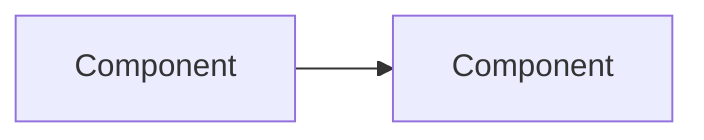

# CLAUDE.md

This file provides guidance to Claude Code (claude.ai/code) when working with code in this repository.

## Project Overview

Budget Analyser is a cross-platform desktop GUI application for personal finance tracking built with PySide6 (Qt) and pandas. It processes bank statements (CSV), categorizes transactions using JSON keyword mappings, stores them in SQLite, and presents reports in a GUI with light/dark themes.

## Development Commands

```bash
# Install dependencies
pip install -r requirements.txt

# Run the application
python -m budget_analyser

# Run tests
pytest -q

# Run linting
pylint src/budget_analyser
```

## Architecture

**Hybrid architecture**: horizontal layered foundation + **vertical feature slices**. Migrated features (starting with `budget_goals`) own all layers in a single directory. Unmigrated features still span the traditional horizontal layers.

```
src/budget_analyser/
├── core/            # Shared foundation (protocols, errors, DB utils, shared DTOs)
│   ├── protocols.py     # Domain interfaces (StatementRepository, etc.)
│   ├── errors.py        # Domain exception hierarchy
│   ├── database.py      # Shared SQLite connection factory
│   └── models.py        # Cross-feature DTOs (MonthlyReports)
├── features/        # Vertical feature slices (self-contained modules)
│   └── budget_goals/    # PILOT: complete vertical slice
│       ├── models.py        # BudgetGoal, EarningsGoal, BudgetProgress DTOs
│       ├── repository.py    # SQLite CRUD (uses core.database)
│       ├── service.py       # Pure business logic functions
│       ├── controller.py    # Thin facade → repo + service
│       └── page.py          # BudgetGoalsPage Qt widget
├── views/           # GUI layer (PySide6 widgets) - exempted from pylint
│   ├── app_gui.py   # Composition root, logging setup, flow control
│   ├── dashboard_window.py  # Main shell (menu, header, nav, stacked pages)
│   ├── pages/       # Dashboard pages (earnings, expenses, mapper, etc.)
│   └── widgets/     # Reusable Qt widgets
├── controller/      # Legacy presentation layer (being migrated to features/)
│   ├── backend_controller.py  # Orchestrates end-to-end workflow
│   ├── budget_controller.py   # Facade: delegates goals to features/budget_goals
│   └── *_controller.py        # Page-specific controllers
├── domain/          # Legacy business logic (being migrated to features/)
│   ├── protocols.py             # Backward-compat shim → core.protocols
│   ├── errors.py                # Backward-compat shim → core.errors
│   ├── statement_formatter.py   # Factory for bank-specific formatters
│   ├── statement_formatters/    # Bank-specific CSV parsers
│   ├── transaction_processor.py # Categorization logic
│   ├── transaction_ingestion.py # CSV → DB pipeline
│   ├── reporting.py             # Report generation service
│   ├── forecasting.py           # Expense forecasting
│   ├── trend_analysis.py        # MoM/YoY trend analysis
│   ├── burn_rate.py             # Budget burn rate calculations
│   ├── spending_patterns.py     # Pareto, anomaly detection
│   ├── payment_matching.py      # Payment reconciliation
│   ├── categorization_suggestions.py  # Auto-suggest categories
│   └── export_service.py        # CSV/Excel/PDF export
├── infrastructure/  # Persistence & external systems
│   ├── database.py, budget_database.py  # SQLite adapters (budget_goals migrated)
│   ├── json_mappings.py                 # JSON mapper loader/saver
│   └── ini_config.py                    # INI config parsing
├── settings/        # Configuration (settings.py, preferences.py)
└── data/            # Application data (not code)
    ├── config/budget_analyser.ini   # Runtime config
    ├── mappers/*.json               # Keyword → category mappings
    ├── statements/                  # User CSV files
    └── budget_analyser.db           # SQLite database
```

**Key data flow:**
1. CSV files → Bank-specific formatter → Transaction processor → SQLite DB
2. SQLite DB → ReportService → MonthlyReports → Dashboard pages

**Entry point:** `python -m budget_analyser` → `views/app_gui.py::run_app()` → LoginWindow → DashboardWindow

**Migration pattern:** Features are incrementally extracted from horizontal layers into `features/<name>/` vertical slices. Old files become backward-compat shims (re-exports) until all consumers migrate.

## Code Style & Linting

**All code must comply with PEP 8 and pylint.** Run `pylint src/budget_analyser` before committing.

Pylint configuration (`.pylintrc`):
- Max line length: 100 characters
- Max function arguments: 6
- Max local variables: 15
- Max branches: 12
- Max statements per function: 50
- Views layer (`src/budget_analyser/views/`) is exempted from linting

### Type Hints (Mandatory)

Type hints are **required** on all function and method signatures (parameters and return types).

```python
from __future__ import annotations  # Required in every module

# Use modern type syntax (Python 3.10+):
def process(self, *, raw_transactions: pd.DataFrame) -> pd.DataFrame: ...
def get_budget(self, category: str, year_month: str = "ALL") -> BudgetGoal | None: ...
def get_accounts(self) -> list[Account]: ...
def get_mappings(self) -> dict[str, list[str]]: ...

# Use collections.abc for abstract types:
from collections.abc import Callable, Mapping, Sequence
def run(self, *, formatter: Callable[[str], str]) -> Sequence[dict[str, float]]: ...
```

**Rules:**
- `from __future__ import annotations` in every module
- Use `X | None` instead of `Optional[X]`
- Use `list[x]`, `dict[k, v]`, `tuple[a, b]` instead of `List`, `Dict`, `Tuple` from `typing`
- Use `collections.abc` for `Callable`, `Mapping`, `Sequence`, `Iterable`
- Only import from `typing` when needed: `Any`, `Protocol`, `ClassVar`, `TypeVar`

### Coding Guidelines

- Prefer keyword-only arguments (`def foo(*, arg1, arg2)`) for clarity
- Keep functions focused and single-purpose
- Extract complex conditions into well-named boolean variables
- No magic numbers — use named constants
- Meaningful names over comments (code should be self-documenting)
- Functions should operate at one level of abstraction

## Documentation Standards

**All public classes, methods, and functions must have Google-style docstrings.**

```python
def calculate_burn_rate(
    *,
    transactions: pd.DataFrame,
    budget_limit: float,
    as_of_date: date | None = None,
) -> BurnRateMetrics:
    """Calculate daily spending velocity and project monthly total.

    Computes how fast the budget is being consumed based on
    spending patterns up to the given date.

    Args:
        transactions: DataFrame with 'amount' and 'transaction_date' columns.
        budget_limit: Monthly budget ceiling for the category.
        as_of_date: Date to calculate burn rate as of. Defaults to today.

    Returns:
        BurnRateMetrics with daily rate, projection, and remaining budget.

    Raises:
        ValidationError: If transactions DataFrame is missing required columns.
    """
```

**When to write docstrings:**

| Scope | Required | Notes |
|-------|----------|-------|
| Public classes | Yes | Describe purpose and usage |
| Public methods/functions | Yes | Args, Returns, Raises sections |
| Private methods (`_helper`) | Only if logic is non-obvious | Keep brief |
| Module-level | Optional | Only for complex modules |
| Test functions | No | Test name should be self-documenting |
| Views layer | No | GUI code is exempted |

**Google-style sections to use:**

| Section | When |
|---------|------|
| `Args:` | Function takes parameters |
| `Returns:` | Function returns a value |
| `Raises:` | Function raises exceptions |
| `Note:` | Important caveats or context |
| `Example:` | Complex or non-obvious usage |

## Versioning

- **Patch** version auto-increments on push to `main` via GitHub Actions
- **Minor/Major** versions: create Git tags manually (`git tag -a vX.Y.0 -m "..."`)
- Set `eng_ver = 0` in `pyproject.toml` during development to disable auto-increment

## Git Commits

**Always use signed commits and semantic commit messages.**

```bash
# Commit with GPG signing
git commit -S -m "type: description"
```

**Semantic commit format:**
```
<type>: <short description>

[optional body with more details]

Author: Prabhukumar Sivamorthy
```

**Commit types:**
| Type | Description |
|------|-------------|
| `feat` | New feature |
| `fix` | Bug fix |
| `docs` | Documentation changes |
| `style` | Code style (formatting, no logic change) |
| `refactor` | Code refactoring (no feature/fix) |
| `test` | Adding or updating tests |
| `chore` | Maintenance tasks, dependencies |

## Design Patterns & Modularity

**Always use appropriate design patterns.** Select the best-fit pattern for the problem:

| Pattern | When to Use | Example in Codebase |
|---------|-------------|---------------------|
| **Vertical Slice** | Self-contained feature owning all layers | `features/budget_goals/` (models, repo, service, controller, page) |
| **Strategy** | Multiple algorithms for same task | `StatementFormatters` (Citi, Discover, Default) |
| **Factory** | Object creation with selection logic | `create_statement_formatter()` |
| **Template Method** | Define algorithm skeleton, let subclasses override steps | `BaseStatementFormatter._bank_specific_formatting()` |
| **Repository** | Abstract data access | `BudgetGoalsRepository`, `TransactionDatabase`, `CsvStatementRepository` |
| **Protocol/Interface** | Decouple layers, enable testing | `core.protocols`: `StatementRepository`, `ColumnMappingProvider` |
| **Service** | Pure business logic functions | `budget_goals.service`, `ReportService`, `TransactionProcessor` |
| **Dependency Injection** | Loose coupling, testability | Controllers receive dependencies via constructor |
| **Observer** | Event-driven communication | Qt Signal/Slot (`upload_successful`, `refresh_requested`) |
| **Composition Root** | Single wiring location for all dependencies | `app_gui.py::_build_controller()` |
| **Data Transfer Object** | Pass data across layers immutably | `MonthlyReports`, `BudgetGoal` (frozen dataclasses) |

### Clean Code Principles

- **Single Responsibility Principle (SRP)** — every class and function does one thing
- **One class per file** — each module has a single public class or cohesive set of functions
- **DRY (Don't Repeat Yourself)** — extract duplicated logic into helpers or shared utilities
- **Layered architecture** — views → controllers → domain → infrastructure (no skipping layers)
- **Domain independence** — domain layer has no dependencies on infrastructure (use protocols)
- **Protocol-based abstractions** — define interfaces in domain, implement in infrastructure
- **Frozen dataclasses** for immutable configuration and DTOs
- **Pure functions** in domain where possible (no side effects)
- **Composition over inheritance** — prefer injecting collaborators over deep class hierarchies
- **Fail fast** — validate inputs at boundaries, raise domain exceptions early

### When Adding New Features

**Prefer vertical slices** for new features (follow the `budget_goals` pilot pattern):

1. Create `features/<name>/` with: `models.py`, `repository.py`, `service.py`, `controller.py`, `page.py`
2. DTOs in `models.py` — simple dataclasses
3. Database access in `repository.py` — uses `core.database.get_connection()`
4. Pure business logic in `service.py` — no PySide6 or infrastructure dependencies
5. Thin controller in `controller.py` — delegates to repository + service
6. Page view in `page.py` — receives controller via constructor
7. Wire in `app_gui.py` composition root
8. Add unit tests: `tests/unit/test_<feature>_{service,repository,controller}.py`
9. Keep backward-compat shims in old locations during migration

**For changes to legacy (unmigrated) features:**

1. Identify which layer(s) the feature touches
2. Define protocols/interfaces first if crossing layers
3. Implement in infrastructure, consume in domain/controller
4. Keep business logic in domain layer, not in views or infrastructure
5. Use dependency injection to wire components together
6. Write Google-style docstrings for all public APIs
7. Add type hints to all signatures

## Diagrams (Hybrid Approach)

Use **Mermaid** for inline diagrams in markdown files (renders on GitHub):



Use **PlantUML** for detailed UML diagrams in `docs/uml/*.puml` (requires export to PNG).

| Tool | Use For | Location |
|------|---------|----------|
| **Mermaid** | Architecture, flowcharts, sequences in docs | `docs/*.md`, `README.md` |
| **PlantUML** | Detailed class diagrams, complex UML | `docs/uml/*.puml` |

**Mermaid diagram types:**
- `flowchart` - Architecture, data flow
- `sequenceDiagram` - API calls, process flows
- `classDiagram` - Class relationships
- `erDiagram` - Database schema
- `stateDiagram-v2` - State machines

## Testing

**Follow Test-Driven Development (TDD).** Write tests before implementing features.

**TDD workflow:**
1. **Write test first** - Create failing test for the new feature/fix
2. **Implement code** - Write minimal code to make the test pass
3. **Refactor** - Clean up while keeping tests green
4. **Run unit tests** - All unit tests must pass before committing

**Test types:**

| Type | Purpose | Location | Scope |
|------|---------|----------|-------|
| **Unit** | Test individual functions/classes in isolation | `tests/unit/` | Single module, mocked dependencies |
| **Integration** | Test component interactions | `tests/integration/` | Multiple modules, real dependencies |
| **System** | Test end-to-end workflows | `tests/system/` | Full application, user scenarios |

```bash
# Run unit tests (REQUIRED before committing)
pytest tests/unit/ -q

# Run integration tests
pytest tests/integration/ -q

# Run system tests
pytest tests/system/ -q

# Run all tests
pytest -q

# Run with coverage
pytest --cov=src/budget_analyser
```

**Testing requirements:**
- Every new feature must have unit tests (required), integration/system tests as appropriate
- Every bug fix must have a regression test
- **All unit tests must pass before committing** (`pytest tests/unit/ -q`)
- Tests in `tests/` directory using pytest
- `tests/conftest.py` adds `src/` to PYTHONPATH
- CI runs on Linux/macOS/Windows across Python 3.10-3.12

**Test organization:**
```
tests/
├── unit/           # Fast, isolated tests (mock external dependencies)
│   ├── test_budget_goals_service.py      # Feature slice: service pure functions
│   ├── test_budget_goals_repository.py   # Feature slice: SQLite CRUD (tmp_path)
│   ├── test_budget_goals_controller.py   # Feature slice: controller integration
│   ├── test_budget_controller.py         # Legacy facade backward compat
│   ├── test_keyword_matching.py          # Domain business logic
│   ├── ... (other domain/controller tests)
├── integration/    # Component interaction tests (real DB, file I/O)
└── system/         # End-to-end workflow tests (full app scenarios)
```

**Naming conventions:**
- Use descriptive test names: `test_<function>_<scenario>_<expected>`
- Group related tests in classes when appropriate
- Prefix test files with `test_`

**Test execution:**

| Stage | Tests Run | Purpose |
|-------|-----------|---------|
| **Before commit** | Unit tests only | Fast feedback, catch logic errors |
| **CI pipeline** | Unit → Integration → System | Full validation across all layers |

**Coverage focus:**

| Test Type | Focus Areas |
|-----------|-------------|
| **Unit** | Domain layer (business logic), controllers, pure functions |
| **Integration** | Database operations, file I/O, CSV parsing, JSON mappings |
| **System** | Critical user workflows (CSV import → categorization → reports) |

**GUI testing (for system tests):**
- Prefer controller-level system tests (faster, less flaky)
- Use `pytest-qt` for GUI tests only when necessary (critical UI flows)
- Keep GUI tests minimal - focus on user-facing critical paths
- Mock heavy dependencies (DB, file system) even in GUI tests when possible

## Skills

### PySide6 UI Designer (`.claude/skills/pyside6-ui-designer.md`)
Automatically applied when designing, building, or modifying any UI component. Enforces the project's design system: centralized tokens from `constants.py`, dual theme support, page structure via `ModernPageMixin`, icon system with fallbacks, and financial UI best practices. Always reference this skill for any views-layer work.
