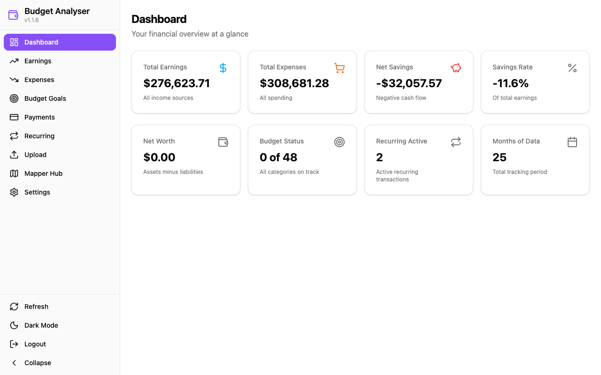
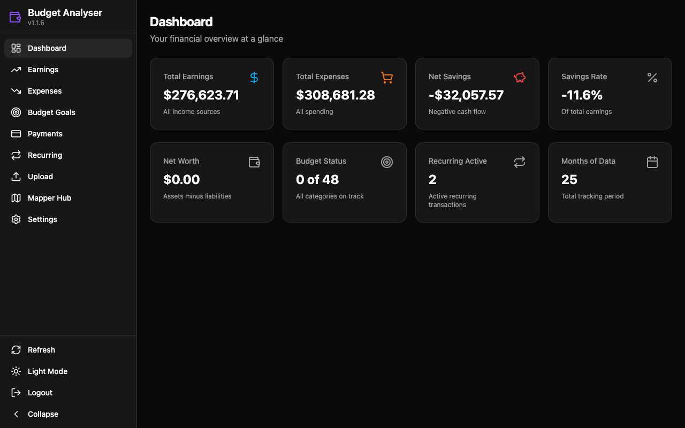
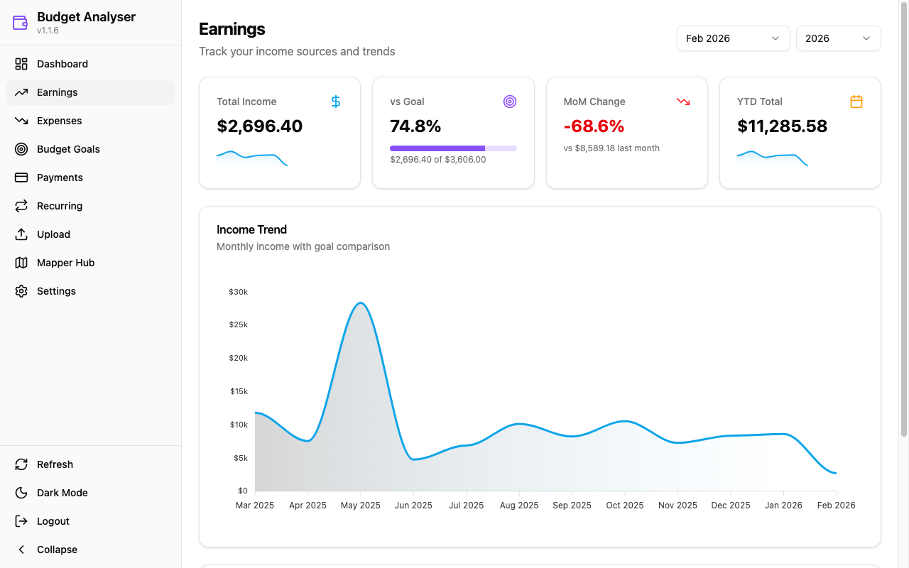
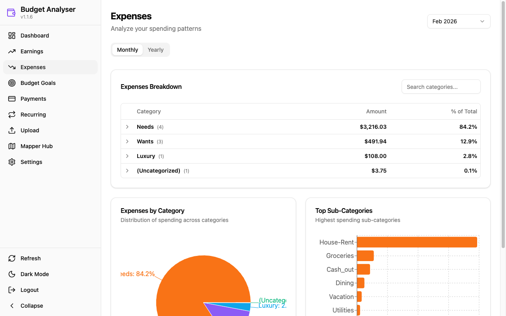
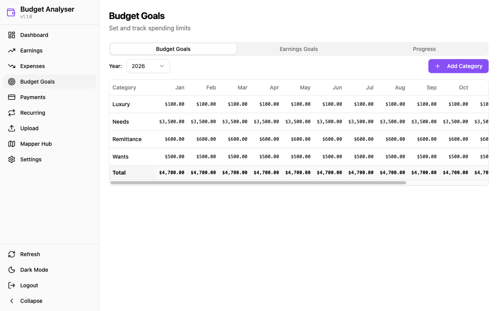
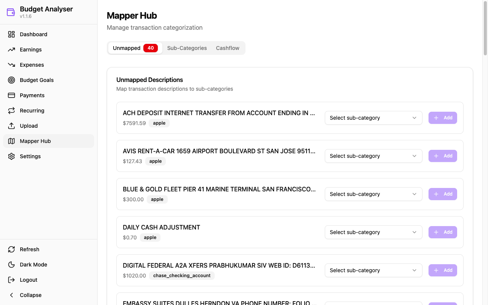

# Budget Analyser

[](https://github.com/Harvest-Forged-Code/Analyser/actions/workflows/tests.yml)
[](https://github.com/Harvest-Forged-Code/Analyser/actions/workflows/release.yml)

Modern, cross-platform budget analysis app built with **Tauri v2**, **React**, **FastAPI**, and **pandas**. It processes bank statements (CSV), categorizes transactions using JSON keyword mappings, stores data in SQLite, and presents interactive reports with light/dark theme support.



## Downloads

Pre-built desktop apps are available for Windows and macOS:

| Platform | Download |
|----------|----------|
| **Windows** | [Latest Release (.exe)](https://github.com/Harvest-Forged-Code/Analyser/releases/latest) |
| **macOS (Apple Silicon)** | [Latest Release (.dmg)](https://github.com/Harvest-Forged-Code/Analyser/releases/latest) |

See [Releases](https://github.com/Harvest-Forged-Code/Analyser/releases) for all versions.

### macOS Installation (Gatekeeper Bypass)

When you first open the app on macOS, you may see a warning: **"Apple could not verify 'Budget Analyser.app' is free of malware"**. This is because the app is not signed with an Apple Developer certificate.

**To open the app:**

1. **Right-click** (or Control-click) on `Budget Analyser.app`
2. Select **"Open"** from the context menu
3. Click **"Open"** in the dialog that appears

This only needs to be done once. After that, the app will open normally.

**Alternative method (Terminal):**
```bash
xattr -d com.apple.quarantine "/Applications/Budget Analyser.app"
```

## Screenshots

### Dashboard
Financial overview with earnings, expenses, net savings, budget status, and recurring transaction summaries.


### Dark Mode
Full dark theme support across all pages.



### Earnings
Track income sources with trend charts, goal progress, month-over-month comparisons, and YTD totals.



### Expenses
Analyze spending with category/sub-category breakdowns, pie charts, and horizontal bar charts.



### Budget Goals
Set and track monthly spending limits per category with an editable 12-month grid.



### Mapper Hub
Categorize unmapped transactions by assigning sub-categories with keyword-based matching.



## Highlights

- **Dashboard** with earnings, expenses, net savings, savings rate, net worth, budget status, recurring transactions, and data coverage
- **Earnings & Expenses** pages with month/year selectors, trend charts, goal tracking, and hierarchical category breakdowns
- **Budget Goals** with editable monthly budgets per category and earnings goal tracking
- **Payments Reconciliation** comparing payments made vs payment confirmations per month
- **Recurring Transactions** with cost trend analysis and category breakdown charts
- **Mapper Hub** for categorizing unmapped transactions with sub-category assignment
- **Upload** page for importing new bank statements (CSV)
- **Settings** page for password management and logging configuration
- **Light/Dark theme** toggle with persistence
- **Export** support for CSV, Excel, and PDF

## Tech Stack

| Layer | Technology |
|-------|-----------|
| **Desktop Shell** | Tauri v2 (Rust) |
| **Frontend** | React, TypeScript, Vite, Tailwind CSS, shadcn/ui |
| **Charts** | Recharts |
| **API** | FastAPI (Python) on port 8741 |
| **Data Processing** | pandas |
| **Database** | SQLite |
| **Testing** | pytest (backend), Playwright (E2E) |
| **Package Manager** | uv (Python), npm (frontend) |

## Architecture

**Vertical feature slices** with 13 self-contained feature modules. Each feature owns its layers: `models.py` (DTOs + data access) and `service.py` (business logic).

```
src/budget_analyser/
├── api/             # FastAPI REST API (17 routers)
├── core/            # Shared protocols, errors, DB utilities
├── features/        # 13 vertical feature slices
│   ├── budget_goals/    ├── net_worth/
│   ├── recurring/       ├── savings/
│   ├── forecasting/     ├── trends/
│   ├── export/          ├── payments/
│   ├── reporting/       ├── mappers/
│   ├── ingestion/       ├── recategorize/
│   └── settings/
├── settings/        # Configuration
└── data/            # App data (config, mappers, statements, DB)

src/frontend/
├── src/             # React + TypeScript
│   ├── api/hooks/   # React Query hooks
│   ├── components/  # Reusable UI components
│   └── pages/       # 13 page components
└── src-tauri/       # Tauri Rust shell
```

**Data flow:**
1. CSV files → Bank-specific formatter → Transaction processor → SQLite DB
2. SQLite DB → Feature services → FastAPI → React frontend

**Entry point:** `python -m budget_analyser` → uvicorn serves FastAPI on port 8741

### Supported Banks

Bank-specific formatters handle different CSV column layouts:
- **Citi** (custom formatter)
- **Discover** (custom formatter)
- **Chase**, **Bilt**, **Apple Card** (default formatter)

Column mappings are configured in `budget_analyser.ini`.

## Install

Prerequisites: Python 3.10+, Node.js 18+, Rust (for Tauri builds).

```bash
# Backend dependencies
uv sync --group dev

# Frontend dependencies
cd src/frontend && npm install
```

## Run

```bash
# API server only
uv run python -m budget_analyser

# Full desktop app (Tauri + React + API)
cd src/frontend && npm run tauri dev

# Frontend dev server only (connects to API on port 8741)
cd src/frontend && npm run dev
```

## Run Tests

```bash
# Unit tests (required before committing)
uv run pytest src/test/unit/ -q

# All tests with coverage
uv run pytest --cov=src/budget_analyser

# E2E tests
cd src/frontend && npm run test:e2e

# Linting
uv run pylint src/budget_analyser
```

CI runs the full test suite on Linux/macOS/Windows across Python 3.10-3.12 via GitHub Actions.

## Configuration & Logs

- **Config INI:** `src/budget_analyser/data/config/budget_analyser.ini`
- **Statement dir:** `src/budget_analyser/data/statements/`
- **JSON mappings:** `src/budget_analyser/data/mappers/*.json`
- **Database:** `src/budget_analyser/data/budget_analyser.db` (SQLite)
- **Logs:** `src/budget_analyser/data/logs/gui_app.log` (rotating; override via `BUDGET_ANALYSER_LOG_DIR`)

## Notes on Data & Signs

- Domain reporting enforces signs: Earnings shown as positive, Expenses as negative.
- "payment_confirmations" are excluded from Earnings; "payments_made" are excluded from Expenses in standard reports (still visible in Payments page).

## Versioning

Budget Analyser uses **semantic versioning** (`Major.Minor.Patch`):

| Version Part | Update Method | Example |
|--------------|---------------|---------|
| Patch (x.x.**X**) | Automatic on push to main | 1.0.5 → 1.0.6 |
| Minor (x.**X**.0) | Manual: `git tag -a v1.1.0 -m "..."` | 1.0.6 → 1.1.0 |
| Major (**X**.0.0) | Manual: `git tag -a v2.0.0 -m "..."` | 1.1.0 → 2.0.0 |

### Developer Mode

Set `eng_ver = 0` in `pyproject.toml` to disable auto-increment during development:

```toml
[tool.budget-analyser]
eng_ver = 0  # Developer mode - no auto-increment
```

Set back to `eng_ver = 1` for production releases.
