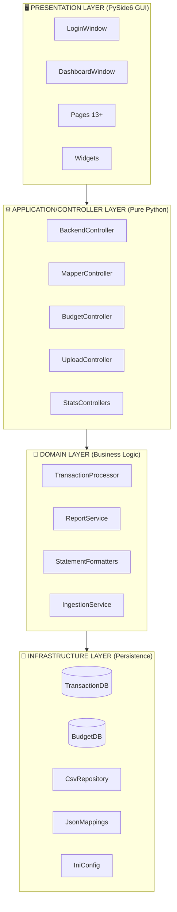
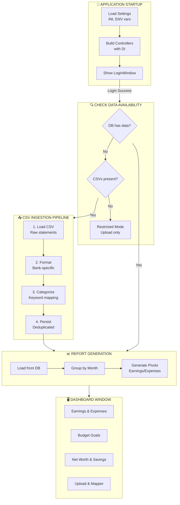

# High-Level Design (HLD) - Budget Analyser

## 1. System Overview

**Budget Analyser** is a cross-platform desktop application for personal finance tracking and analysis. It processes bank statement CSV files, categorizes transactions using keyword mappings, and generates comprehensive financial reports through an intuitive GUI.

### Primary Goals

- Ingest bank statements from multiple sources (Chase, Citi, Discover, Bilt)
- Automatically categorize transactions using configurable keyword mappings
- Generate monthly and yearly financial reports with hierarchical category breakdowns
- Support budget goal setting and expense tracking
- Track recurring transactions and net worth
- Provide an intuitive GUI for financial analysis

### Target Users

Individual users who want to:
- Consolidate statements from multiple bank accounts
- Understand spending patterns across categories
- Set and track budget goals
- Monitor net worth over time

---

## 2. Architecture Overview

The application follows a **Layered Architecture** with clear separation of concerns:



---

## 3. Design Patterns

| Pattern | Usage |
|---------|-------|
| **Layered Architecture** | Separates presentation, application, domain, and infrastructure |
| **Dependency Injection** | Controllers receive dependencies through constructor injection |
| **Protocol/Interface** | Domain defines stable interfaces; infrastructure implements |
| **Strategy** | Bank-specific statement formatters (Citi, Discover, Default) |
| **Factory** | `create_statement_formatter()` selects formatter by account |
| **Repository** | Database and CSV repositories abstract data access |
| **Service Layer** | Domain services encapsulate business logic |

---

## 4. Major Components

### 4.1 Presentation Layer (`views/`)

| Component | Responsibility |
|-----------|----------------|
| `app_gui.py` | Composition root; logging setup; launches Qt application |
| `login_window.py` | Password-protected authentication |
| `dashboard_window.py` | Main shell with navigation sidebar and page container |
| `pages/` | 13+ specialized pages for different features |
| `widgets/` | Reusable UI components |
| `styles.py` | Theme management (light/dark), stylesheets |

### 4.2 Controller Layer (`controller/`)

| Controller | Responsibility |
|------------|----------------|
| `BackendController` | Orchestrates load → format → process → report workflow |
| `UploadController` | Validates and processes uploaded CSV files |
| `MapperController` | Manages description→sub_category keyword mappings |
| `BudgetController` | Budget goals, savings, net worth, recurring detection |
| `ExpensesStatsController` | Generates expense reports and pivots |
| `EarningsStatsController` | Generates earnings reports |
| `YearlySummaryStatsController` | Year-over-year aggregations |
| `SettingsController` | Application preferences management |

### 4.3 Domain Layer (`domain/`)

| Service | Responsibility |
|---------|----------------|
| `TransactionProcessor` | Applies keyword mappers to categorize transactions |
| `TransactionIngestionService` | End-to-end CSV ingestion pipeline |
| `ReportService` | Generates earnings/expenses reports with pivoting |
| `StatementFormatters` | Normalize bank CSVs to canonical schema |
| `CategoryMappers` | Immutable container for keyword mappings |

### 4.4 Infrastructure Layer (`infrastructure/`)

| Adapter | Responsibility |
|---------|----------------|
| `TransactionDatabase` | SQLite persistence for processed transactions |
| `BudgetDatabase` | SQLite persistence for budgets, accounts, recurring |
| `CsvStatementRepository` | Loads CSV files from filesystem |
| `IniAppConfig` | Reads INI configuration |
| `JsonCategoryMappingProvider` | Loads/saves JSON keyword mappings |

---

## 5. Data Flow



### Data Flow Summary

| Stage | Component | Input | Output |
|-------|-----------|-------|--------|
| 1. Load | CsvRepository | CSV files | Raw DataFrame |
| 2. Format | StatementFormatter | Raw DataFrame | Normalized DataFrame |
| 3. Categorize | TransactionProcessor | Normalized DataFrame | Categorized DataFrame |
| 4. Persist | TransactionDatabase | Categorized DataFrame | SQLite records |
| 5. Report | ReportService | DB records | MonthlyReports |
| 6. Display | Dashboard Pages | MonthlyReports | GUI widgets |

---

## 6. Technology Stack

| Layer | Technology |
|-------|------------|
| **Presentation** | PySide6 (Qt 6), QSS stylesheets |
| **Application** | Python 3.11+ |
| **Domain Logic** | Pure Python, Pandas DataFrames |
| **Database** | SQLite (file-based) |
| **Configuration** | INI files, JSON files, Environment variables |
| **Build** | setuptools, PyInstaller |
| **Testing** | pytest |
| **Version Control** | Git (tag-based semantic versioning) |

---

## 7. External Dependencies

### Runtime Dependencies

| Package | Version | Purpose |
|---------|---------|---------|
| PySide6 | 6.8.2+ | Qt GUI framework |
| pandas | 2.3.3+ | DataFrame operations |
| sqlite3 | stdlib | Persistent storage |
| configparser | stdlib | INI file parsing |
| json | stdlib | Mapping file I/O |
| logging | stdlib | Application diagnostics |

### Build Dependencies

| Package | Version | Purpose |
|---------|---------|---------|
| PyInstaller | 6.0+ | Executable bundling |
| pytest | 8.3.4+ | Testing framework |
| pylint | - | Code linting |

---

## 8. Deployment Model

### Development Mode

```bash
python -m budget_analyser
```

- Data stored in `src/budget_analyser/data/`
- Configuration via environment variables or `.env` file
- Hot-reload not supported (restart required for config changes)

### Production Mode (Bundled Executable)

- PyInstaller creates standalone `.app` (macOS) or `.exe` (Windows)
- Includes Python runtime, all dependencies, and bundled data
- VERSION file embedded for version detection
- Single-file distribution

### Configuration Precedence

1. Environment variables (highest priority)
2. `.env` file (if present)
3. INI config file
4. Hardcoded defaults (lowest priority)

---

## 9. Security Considerations

| Area | Implementation |
|------|----------------|
| **Authentication** | SHA256-hashed password stored in INI |
| **Data at Rest** | SQLite database (not encrypted) |
| **Sensitive Data** | No cloud sync; all data local |
| **Code Signing** | Not signed (macOS Gatekeeper bypass required) |

---

## 10. Supported Banks

Bank-specific formatters handle different CSV column layouts:

| Bank | Formatter | Notes |
|------|-----------|-------|
| Chase | DefaultStatementFormatter | Standard format |
| Citi | CitiStatementFormatter | Inverts amount signs |
| Discover | DiscoverStatementFormatter | Custom date format |
| Bilt | DefaultStatementFormatter | Standard format |

New banks can be added by:
1. Creating a new formatter class extending `BaseStatementFormatter`
2. Registering in the factory function
3. Adding column mapping to INI config

---

## 11. Key Data Structures

### MonthlyReports

Container for one month's financial data:

| Field | Type | Description |
|-------|------|-------------|
| `month` | pd.Period | Month identifier (e.g., 2024-01) |
| `earnings` | DataFrame | Earnings transactions |
| `expenses` | DataFrame | Expense transactions |
| `expenses_category` | DataFrame | Category → amount pivot |
| `expenses_sub_category` | DataFrame | Sub-category → amount pivot |
| `transactions` | DataFrame | All transactions for the month |

### Canonical Transaction Schema

| Column | Type | Description |
|--------|------|-------------|
| `transaction_date` | datetime | Transaction date |
| `description` | str | Bank description |
| `amount` | float | Signed amount (+: earnings, -: expenses) |
| `from_account` | str | Account identifier |
| `sub_category` | str | Mapped sub-category |
| `category` | str | Parent category |
| `c_or_d` | str | "earnings" or "expenditures" |

---

## 12. Future Extensibility

The architecture supports:

- **New bank formatters**: Add new `StatementFormatter` subclass
- **New report types**: Extend `ReportService` methods
- **New pages**: Add to `views/pages/` and register in dashboard
- **New categorization rules**: Extend mapper JSON files
- **Multi-user support**: Would require authentication refactor
- **Cloud sync**: Would require infrastructure layer additions
