# High-Level Design (HLD) - Budget Analyser

## 1. System Overview

**Budget Analyser** is a cross-platform desktop application for personal finance tracking and analysis. It processes bank statement CSV files, categorizes transactions using keyword mappings, stores them in SQLite, and generates comprehensive financial reports through an intuitive PySide6 GUI with light/dark themes.

### Primary Goals

- Ingest bank statements from multiple sources (Chase, Citi, Discover, Bilt)
- Automatically categorize transactions using configurable keyword mappings with scored matching
- Generate monthly and yearly financial reports with hierarchical category breakdowns
- Support budget goal setting and expense/earnings tracking
- Track recurring transactions, savings, and net worth
- Provide advanced analytics: forecasting, trend analysis, burn rate, spending patterns, anomaly detection
- Export reports in multiple formats (CSV, Excel, PDF)
- Provide an intuitive GUI with 12 specialized pages

### Target Users

Individual users who want to:
- Consolidate statements from multiple bank accounts
- Understand spending patterns across categories
- Set and track budget/earnings goals
- Monitor net worth and savings rate over time
- Forecast future expenses and detect anomalies

---

## 2. Architecture Overview

The application follows a **Hybrid Architecture**: a horizontal layered foundation combined with **vertical feature slices** for cohesive feature modules. Migrated features (starting with `budget_goals`) own all their layers in a single directory, while unmigrated features still span the traditional horizontal layers.

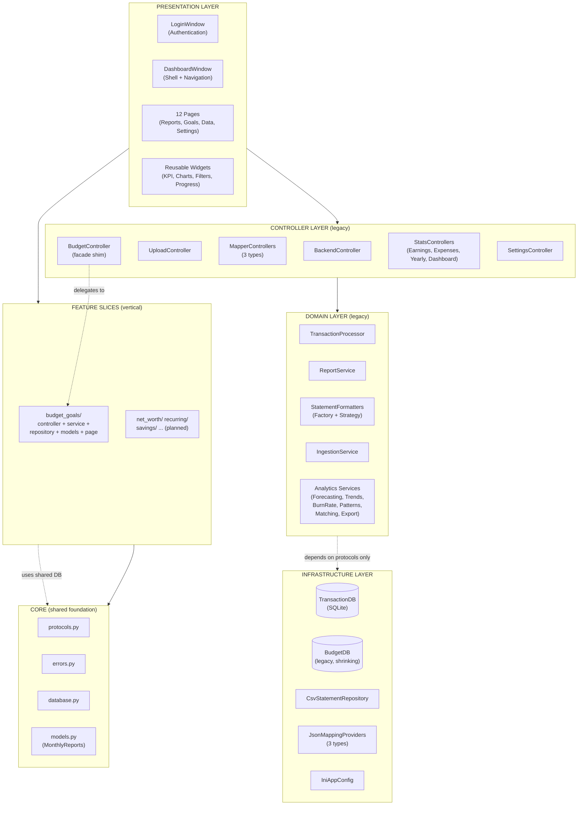

### Dependency Rule

Each layer depends only on the layer directly below it. The domain layer defines **Protocol interfaces** that the infrastructure layer implements. Feature slices depend on the shared `core/` module but not on each other.

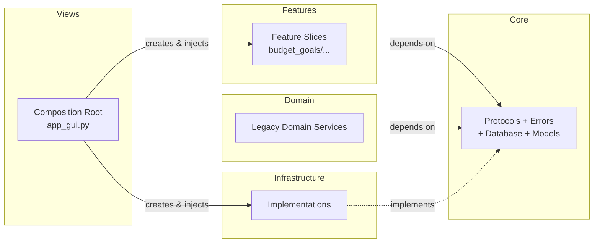

### Migration Strategy

Features are incrementally migrated from horizontal layers to vertical slices:

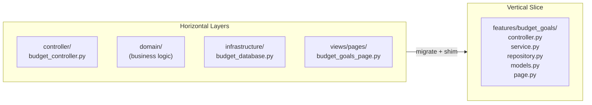

During migration, backward-compatibility shims in old locations re-export from the new feature module, so existing consumers continue to work.

---

## 3. Design Patterns

| Pattern | Usage | Example |
|---------|-------|---------|
| **Vertical Slice** | Each feature owns all layers (model, repo, service, controller, page) | `features/budget_goals/` (pilot), future: net_worth, recurring, savings |
| **Layered Architecture** | Separates presentation, application, domain, and infrastructure | 4-layer structure (legacy, being migrated to slices) |
| **Dependency Injection** | Controllers receive dependencies through constructor injection | `BackendController.__init__(*, statement_repository, ...)` |
| **Protocol/Interface** | Core defines stable interfaces; infrastructure implements | `StatementRepository`, `ColumnMappingProvider`, `CategoryMappingProvider` |
| **Strategy** | Bank-specific statement formatters with different algorithms | `CitiStatementFormatter`, `DiscoverStatementFormatter`, `DefaultStatementFormatter` |
| **Factory** | `create_statement_formatter()` selects formatter by account | Returns appropriate strategy based on account name |
| **Repository** | Database and CSV repositories abstract data access | `BudgetGoalsRepository`, `CsvStatementRepository`, `DatabaseTransactionRepository` |
| **Service Layer** | Pure business logic functions with no infrastructure deps | `budget_goals.service`, `ReportService`, `TransactionProcessor` |
| **Observer** | Qt Signal/Slot for event-driven UI communication | `upload_successful`, `refresh_requested`, `reload_requested` |
| **Template Method** | Base formatter defines steps; subclasses override hooks | `BaseStatementFormatter._bank_specific_formatting()` |
| **Data Transfer Object** | Immutable frozen dataclasses pass data across layers | `MonthlyReports`, `BudgetGoal`, `IngestionResult` |
| **Mixin** | Reusable UI utilities for consistent page styling | `ModernPageMixin` |
| **Composition Root** | Single location wires all dependencies | `app_gui.py::_build_controller()` |

---

## 4. Major Components

### 4.1 Core Module (`core/`)

Shared foundations that all feature slices and legacy layers depend on:

| Module | Responsibility |
|--------|----------------|
| `protocols.py` | Domain interfaces: `StatementRepository`, `ColumnMappingProvider`, `CategoryMappingProvider` |
| `errors.py` | Domain exception hierarchy: `DomainError`, `ValidationError`, `MappingNotFoundError`, `DataSourceError` |
| `database.py` | Shared SQLite connection factory (`get_connection()`) used by all feature repositories |
| `models.py` | Cross-feature DTOs: `MonthlyReports` (frozen dataclass consumed by many pages) |

### 4.2 Feature Slices (`features/`)

Self-contained vertical slices where each feature owns all its layers:

#### `features/budget_goals/` (Pilot - Complete)

| Module | Responsibility |
|--------|----------------|
| `models.py` | `BudgetGoal`, `EarningsGoal`, `BudgetProgress` DTOs |
| `repository.py` | `BudgetGoalsRepository` — SQLite CRUD for budget_goals and earnings_goals tables |
| `service.py` | Pure business logic: `calculate_budget_progress()`, `build_earnings_goal_map()` |
| `controller.py` | `BudgetGoalsController` — thin facade delegating to repository + service |
| `page.py` | `BudgetGoalsPage` — Qt widget with Set Goals and Manage Goals tabs |

#### Planned Feature Slices (Phase 3)

| Feature | Status | Key Responsibilities |
|---------|--------|----------------------|
| `net_worth/` | Planned | Account management, net worth calculation |
| `recurring/` | Planned | Recurring transaction detection and tracking |
| `savings/` | Planned | Savings rate metrics and monthly breakdown |
| `ingestion/` | Planned | CSV import pipeline |
| `mappers/` | Planned | Category mapping CRUD |
| `reporting/` | Planned | Earnings and expenses report generation |
| `payments/` | Planned | Payment reconciliation |
| `forecasting/` | Planned | Time-series expense forecasting |
| `trends/` | Planned | Trend analysis and spending patterns |
| `export/` | Planned | CSV/Excel/PDF export |
| `settings/` | Planned | Application preferences |

### 4.3 Presentation Layer (`views/`)

| Component | Responsibility |
|-----------|----------------|
| `app_gui.py` | Composition root; logging setup; dependency wiring; launches Qt application |
| `login_window.py` | Password-protected authentication with SHA-256 salted hashing |
| `dashboard_window.py` | Main shell with header bar, collapsible sidebar navigation, stacked page container |
| `pages/` (12 pages) | Specialized pages for reports, goals, data management, settings |
| `widgets/` (8+ files) | Reusable UI components: KPI cards, charts, filters, progress bars, empty states, goal cards |
| `styles.py` | Theme management (light/dark), QSS stylesheets |

### 4.4 Controller Layer (`controller/` — legacy, being migrated)

| Controller | Responsibility | Migration Status |
|------------|----------------|------------------|
| `BackendController` | Orchestrates load -> format -> process -> report pipeline | Stays (cross-cutting) |
| `UploadController` | Validates and processes uploaded CSV files with ingestion | Planned: `features/ingestion/` |
| `MapperController` | Manages description -> sub_category keyword mappings | Planned: `features/mappers/` |
| `SubCategoryMapperController` | Manages sub_category -> category mappings | Planned: `features/mappers/` |
| `CashflowMapperController` | Manages category -> earnings/expenses classification | Planned: `features/mappers/` |
| `BudgetController` | **Backward-compat facade** — delegates budget/earnings goals to `features/budget_goals`; retains savings, net worth, recurring until migrated | Partially migrated |
| `ExpensesStatsController` | Generates expense reports, category nodes, pivots | Planned: `features/reporting/` |
| `EarningsStatsController` | Generates earnings reports and breakdowns | Planned: `features/reporting/` |
| `YearlySummaryStatsController` | Year-over-year aggregations | Planned: `features/reporting/` |
| `CashflowDashboardController` | Cashflow dashboard KPIs and charts | Planned: `features/reporting/` |
| `SettingsController` | Application preferences management | Planned: `features/settings/` |

### 4.5 Domain Layer (`domain/` — legacy, being migrated)

| Service | Responsibility |
|---------|----------------|
| `TransactionProcessor` | Applies scored keyword matching to categorize transactions |
| `TransactionIngestionService` | End-to-end CSV ingestion pipeline (load -> format -> process -> persist) |
| `ReportService` | Generates earnings/expenses/category reports with pivoting |
| `StatementFormatters` | Normalize bank CSVs to canonical schema (Factory + Strategy) |
| `CategoryMappers` | Immutable container for keyword mappings |
| `KeywordMatching` | Scored substring/exact matching with position and weight bonuses |
| `Forecasting` | Predict future expenses using linear regression with ensemble methods |
| `TrendAnalysis` | Month-over-month, year-over-year trend analysis with volatility |
| `BurnRate` | Calculate spending velocity, projections, and budget warnings |
| `SpendingPatterns` | Pareto analysis, weekly patterns, anomaly detection (Z-score) |
| `PaymentMatching` | Reconcile payment pairs with confidence scoring |
| `CategorizationSuggestions` | Suggest categories for unmapped transactions |
| `ExportService` | Export reports to CSV/Excel/PDF formats |

> **Note:** `Protocols` and `Errors` have moved to `core/`. Old `domain/protocols.py` and `domain/errors.py` are backward-compatibility shims that re-export from `core/`.

### 4.6 Infrastructure Layer (`infrastructure/`)

| Adapter | Responsibility |
|---------|----------------|
| `TransactionDatabase` | SQLite persistence for processed transactions with duplicate prevention |
| `DatabaseTransactionRepository` | Read-only adapter for loading transactions for reports |
| `BudgetDatabase` | SQLite persistence for accounts, recurring (budget/earnings goals migrated to `features/budget_goals/repository.py`) |
| `CsvStatementRepository` | Loads CSV files from filesystem (UTF-8 BOM handling) |
| `IniAppConfig` | Reads INI configuration (accounts, column mappings) |
| `IniColumnMappingProvider` | Per-account column mapping adapter |
| `JsonCategoryMappingProvider` | Loads keyword mappings from JSON files |
| `JsonCategoryMappingStore` | Loads and atomically saves keyword mappings |
| `JsonCashflowMappingProvider` | Loads earnings/expenses classification |
| `JsonCashflowMappingStore` | Loads and atomically saves cashflow mappings |

---

## 5. Application Flow

### 5.1 Startup and Authentication Flow

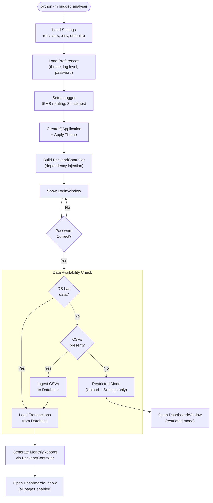

### 5.2 CSV Ingestion Pipeline

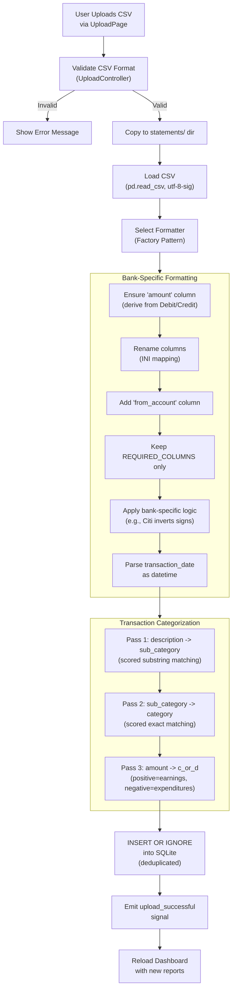

### 5.3 Report Generation Pipeline

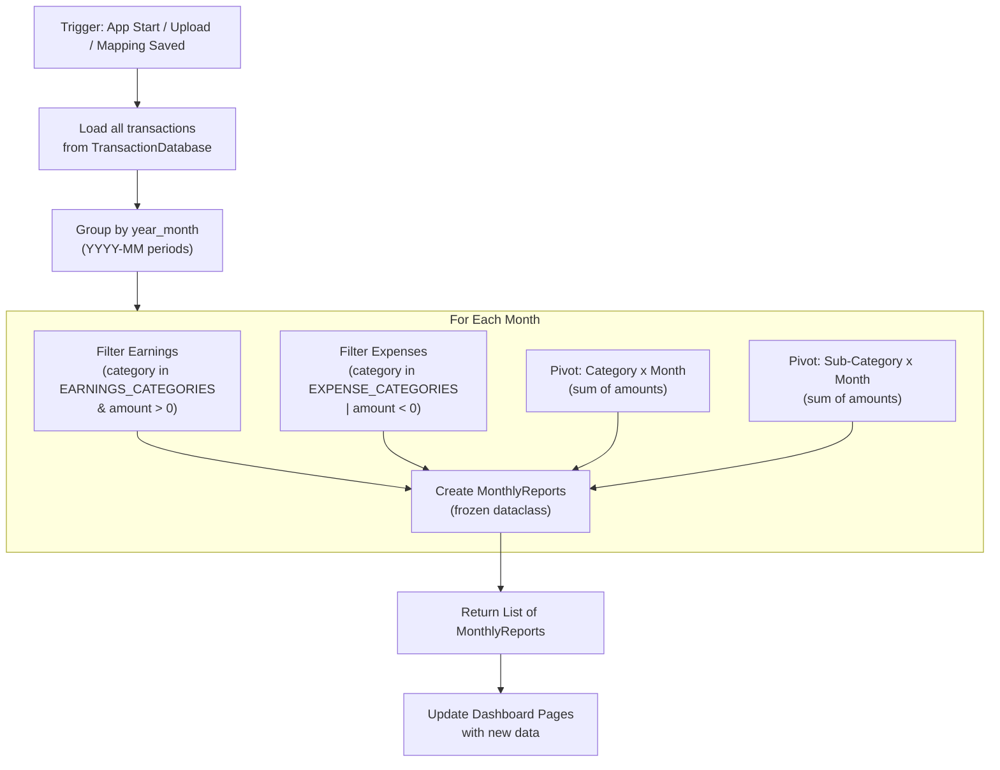

### 5.4 Mapping Refresh Flow

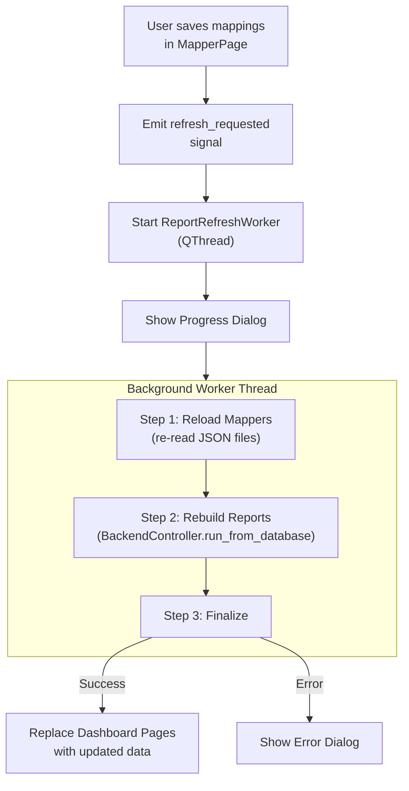

---

## 6. Dashboard Architecture

### 6.1 Navigation Structure

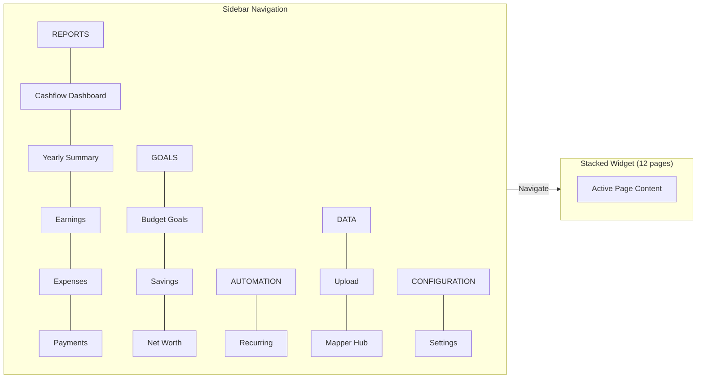

### 6.2 Page-Controller-Domain Mapping

| Page (Index) | Controller | Services / Repository | Module |
|---|---|---|---|
| Cashflow Dashboard (0) | CashflowDashboardController | ReportService, BurnRate | `controller/` (legacy) |
| Yearly Summary (1) | YearlySummaryStatsController | ReportService | `controller/` (legacy) |
| Earnings (2) | EarningsStatsController | ReportService, BudgetGoalsController | `controller/` (legacy) |
| Expenses (3) | ExpensesStatsController | ReportService, BudgetGoalsController | `controller/` (legacy) |
| Payments (4) | - (direct data) | PaymentMatching | `domain/` (legacy) |
| Budget Goals (5) | **BudgetGoalsController** | **BudgetGoalsRepository, service** | **`features/budget_goals/`** |
| Savings (6) | BudgetController | BudgetDatabase | `controller/` (legacy) |
| Net Worth (7) | BudgetController | BudgetDatabase | `controller/` (legacy) |
| Recurring (8) | BudgetController | BudgetDatabase | `controller/` (legacy) |
| Upload (9) | UploadController | TransactionIngestionService | `controller/` (legacy) |
| Mapper Hub (10) | MapperController + 2 sub-controllers | JsonMappingStores | `controller/` (legacy) |
| Settings (11) | SettingsController | AppPreferences | `controller/` (legacy) |

---

## 7. Signal/Event Architecture

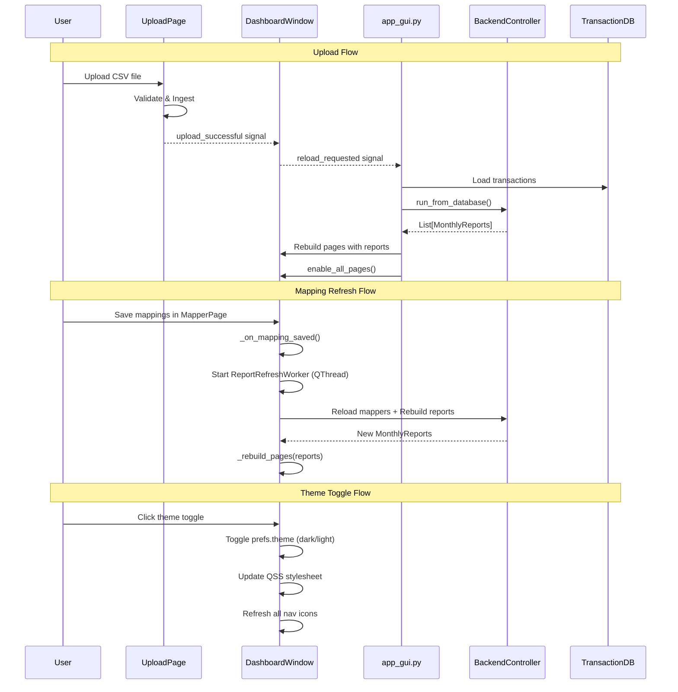

---

## 8. Technology Stack

| Layer | Technology |
|-------|------------|
| **Presentation** | PySide6 (Qt 6), QSS stylesheets, qtawesome icons, pyqtgraph charts |
| **Application** | Python 3.11+ (pure Python controllers) |
| **Domain Logic** | Pure Python, pandas DataFrames, numpy (numerical) |
| **Database** | SQLite (file-based, two databases) |
| **Configuration** | INI files, JSON files, Environment variables, `.env` file |
| **Build** | setuptools, PyInstaller |
| **Testing** | pytest, pytest-qt (optional) |
| **Linting** | pylint (100 char line limit, strict design limits) |
| **CI/CD** | GitHub Actions (test matrix, pylint, multi-platform release) |
| **Version Control** | Git with tag-based semantic versioning |

---

## 9. External Dependencies

### Runtime Dependencies

| Package | Version | Purpose |
|---------|---------|---------|
| PySide6 | ~6.8.2 | Qt GUI framework |
| pandas | ~2.3.3 | DataFrame operations and data analysis |
| numpy | ~2.2.3 | Numerical computing (statistics, forecasting) |
| pyqtgraph | ~0.13.7 | Interactive chart widgets |
| qtawesome | ~1.3.0 | Icon library for navigation and UI |
| sqlite3 | stdlib | Persistent storage |
| configparser | stdlib | INI file parsing |
| json | stdlib | Mapping file I/O |
| logging | stdlib | Application diagnostics |

### Build & Dev Dependencies

| Package | Version | Purpose |
|---------|---------|---------|
| PyInstaller | 6.0+ | Executable bundling (Windows/macOS) |
| pytest | ~8.3.4 | Testing framework |
| pylint | - | Code linting |
| pip | ~25.3 | Package manager |
| wheel | ~0.41.2 | Wheel format support |
| setuptools | ~44.1.1 | Build system |

---

## 10. Deployment Model

### Development Mode

```bash
python -m budget_analyser
```

- Data stored in `src/budget_analyser/data/`
- Configuration via environment variables or `.env` file
- Logs to `data/logs/gui_app.log` (5MB rotating, 3 backups)

### Production Mode (Bundled Executable)

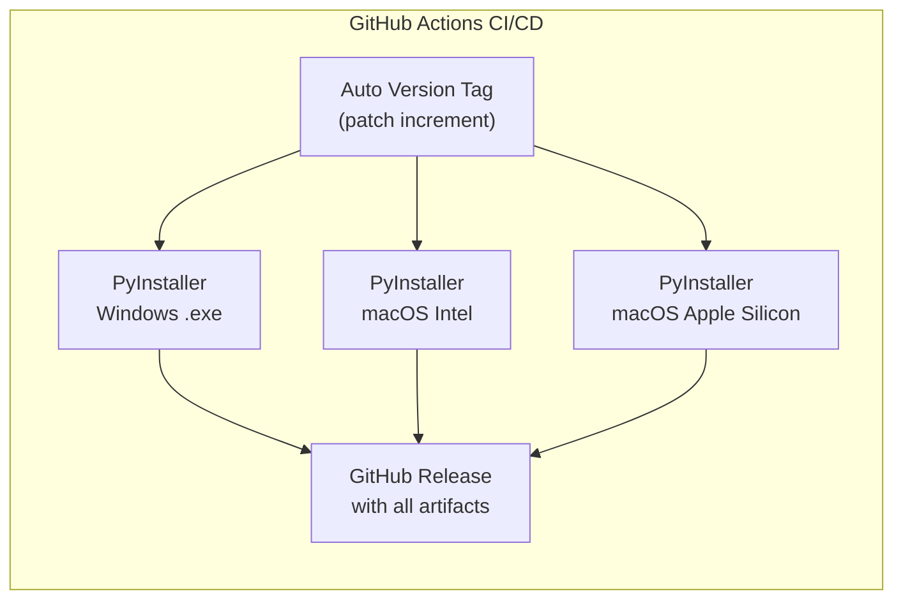

- PyInstaller creates standalone `.app` (macOS) or `.exe` (Windows)
- Includes Python runtime, all dependencies, and bundled data
- VERSION file embedded for version detection
- Single-file distribution per platform

### Configuration Precedence

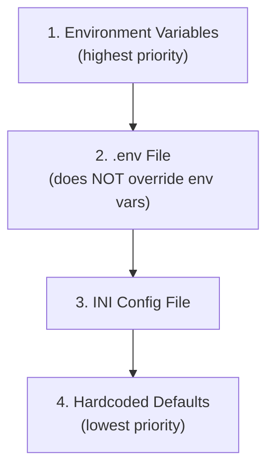

---

## 11. Security Model

| Area | Implementation |
|------|----------------|
| **Authentication** | SHA-256 with 32-byte random salt; stored in INI as `sha256$salt$hash` |
| **SQL Injection** | All queries use parameterized `?` placeholders |
| **Data at Rest** | SQLite database (not encrypted); all data local |
| **Sensitive Data** | No cloud sync; no network calls; purely offline |
| **INI Security** | String interpolation disabled (`interpolation=None`) |
| **Atomic Writes** | JSON mappings use temp file + rename to prevent corruption |
| **Code Signing** | Not signed (macOS Gatekeeper bypass helper included) |

---

## 12. Supported Banks

Bank-specific formatters handle different CSV column layouts:

| Bank | Formatter | Notes |
|------|-----------|-------|
| Chase (credit + checking) | DefaultStatementFormatter | Standard format |
| Citi | CitiStatementFormatter | Inverts amount signs |
| Discover | DiscoverStatementFormatter | Inverts amount signs |
| Bilt | DefaultStatementFormatter | Standard format |

**Adding a new bank:**
1. Create a new formatter class extending `BaseStatementFormatter`
2. Override `_bank_specific_formatting()` for bank-specific logic
3. Register in the factory function (`statement_formatters/factory.py`)
4. Add column mapping section to INI config (`[newbank_map]`)
5. Add account entry under `[credit_cards]` or `[checking_accounts]`

---

## 13. Key Data Structures

### MonthlyReports (Frozen Dataclass)

Container for one month's financial data passed to dashboard pages:

| Field | Type | Description |
|-------|------|-------------|
| `month` | `pd.Period` | Month identifier (e.g., 2024-01) |
| `earnings` | `DataFrame` | Earnings transactions for the month |
| `expenses` | `DataFrame` | Expense transactions for the month |
| `expenses_category` | `DataFrame` | Category -> amount pivot table |
| `expenses_sub_category` | `DataFrame` | Sub-category -> amount pivot table |
| `transactions` | `DataFrame` | All transactions for the month |

### Canonical Transaction Schema

All bank CSVs are normalized to this schema before processing:

| Column | Type | Description |
|--------|------|-------------|
| `transaction_date` | datetime | Transaction date |
| `description` | str | Bank description |
| `amount` | float | Signed amount (+: earnings, -: expenses) |
| `from_account` | str | Account identifier |
| `sub_category` | str | Keyword-matched sub-category |
| `category` | str | Parent category |
| `c_or_d` | str | "earnings" or "expenditures" |

### Three-Level Category Hierarchy

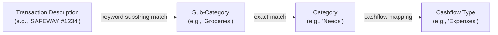

---

## 14. Data Architecture

### Storage Overview

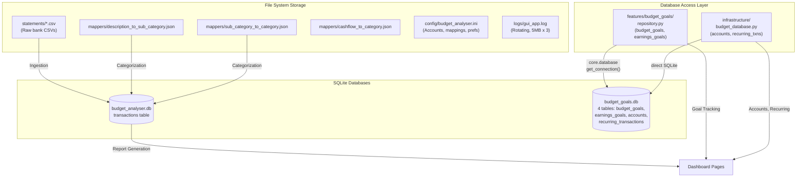

---

## 15. Future Extensibility

The architecture supports:

- **New features via vertical slices**: Create a new `features/<name>/` module with models, repository, service, controller, and page — self-contained and independently testable
- **Migrate existing features**: Follow the `budget_goals` pilot pattern — extract from horizontal layers into a vertical slice, leave backward-compat shims, remove shims once all consumers migrate
- **New bank formatters**: Add `StatementFormatter` subclass + factory registration
- **New report types**: Extend `ReportService` or create new domain services
- **New dashboard pages**: Add page to a feature slice or `views/pages/` and register in `dashboard_window.py`
- **New categorization rules**: Extend mapper JSON files via Mapper Hub UI
- **New analytics**: Add domain services (existing: forecasting, trends, burn rate, patterns)
- **Alternative storage backends**: Implement `StatementRepository` protocol for new sources
- **Export formats**: Extend `ExportService` with new format handlers
- **Multi-user support**: Would require authentication and data isolation refactor
- **Cloud sync**: Would require infrastructure layer additions
- **API layer**: Add REST endpoints consuming existing controllers for web/mobile clients

### Migration Roadmap

Remaining features to migrate to vertical slices (in order):

| Order | Feature | Source | Complexity |
|-------|---------|--------|------------|
| 1 | `net_worth` | BudgetController (accounts), NetWorthPage | Low |
| 2 | `recurring` | BudgetController (recurring), RecurringPage | Low |
| 3 | `savings` | BudgetController (savings), SavingsPage | Low |
| 4 | `ingestion` | transaction_ingestion.py, UploadController, UploadPage | Medium |
| 5 | `mappers` | MapperControllers, mapper pages | Medium |
| 6 | `reporting` | reporting.py, stats controllers, Earnings/ExpensesPage | Medium |
| 7 | `payments` | payment_matching.py, PaymentsController, PaymentsPage | Low |
| 8 | `forecasting` | forecasting.py | Low |
| 9 | `trends` | trend_analysis.py, spending_patterns.py | Low |
| 10 | `export` | export_service.py | Low |
| 11 | `settings` | SettingsController, SettingsPage | Low |

After `net_worth` + `recurring` + `savings` migrate, `BudgetController` and `BudgetDatabase` are fully decomposed and can be deleted.
