# Low-Level Design (LLD) - Budget Analyser

## 1. Class Structures and Relationships

### 1.1 Domain Models

#### Transaction Models

```python
@dataclass
class TransactionRecord:
    transaction_date: str      # ISO date format (YYYY-MM-DD)
    description: str           # Bank description text
    amount: float             # Signed: positive=earnings, negative=expenses
    from_account: str         # Account identifier
    sub_category: str = ""    # Keyword-matched sub-category
    category: str = ""        # Parent category
    c_or_d: str = ""          # "earnings" or "expenditures"
```

#### Shared Cross-Feature DTOs (`core/models.py`)

```python
@dataclass(frozen=True)
class MonthlyReports:
    """Report tables for a single month. Used by many feature pages."""
    month: pd.Period                    # Period object (e.g., 2024-01)
    earnings: pd.DataFrame              # Earnings with amounts
    expenses: pd.DataFrame              # Expenses with amounts
    expenses_category: pd.DataFrame     # Category -> amount pivot
    expenses_sub_category: pd.DataFrame # Sub-category -> amount pivot
    transactions: pd.DataFrame          # Full month's transactions
```

#### Category Mapping Models

```python
@dataclass(frozen=True)
class CategoryMappers:
    description_to_sub_category: Mapping[str, list[str]]  # sub_cat -> [keywords]
    sub_category_to_category: Mapping[str, list[str]]     # category -> [sub_cats]
```

#### Budget & Goal Models (`features/budget_goals/models.py`)

```python
# Migrated to features/budget_goals/models.py (vertical slice)
@dataclass
class BudgetGoal:
    id: int | None
    category: str
    monthly_limit: float
    year_month: str  # "YYYY-MM" or "ALL" for default

@dataclass
class EarningsGoal:
    id: int | None
    sub_category: str
    expected_amount: float
    year_month: str  # "YYYY-MM" or "ALL"

@dataclass
class BudgetProgress:
    category: str
    budget_limit: float
    spent: float
    remaining: float
    percentage: float
    status: str  # "under", "warning", "over"
```

#### Account & Recurring Models (`infrastructure/budget_database.py` — pending migration)

```python
@dataclass
class Account:
    id: int | None
    name: str
    account_type: str  # "checking", "savings", "credit_card", "investment", "loan", "other"
    balance: float
    last_updated: str  # ISO date
    notes: str = ""

@dataclass
class RecurringTransaction:
    id: int | None
    description: str
    expected_amount: float
    frequency: str  # "monthly", "weekly", "yearly", "quarterly"
    category: str
    sub_category: str
    last_occurrence: str  # ISO date
    is_active: bool = True
```

#### Result DTOs

```python
@dataclass(frozen=True)
class UploadResult:
    success: bool
    message: str
    destination_path: str | None = None
    transactions_inserted: int = 0
    duplicates_skipped: int = 0

@dataclass
class IngestionResult:
    success: bool
    message: str
    transactions_processed: int = 0
    transactions_inserted: int = 0
    duplicates_skipped: int = 0
```

#### Analytics Models

```python
@dataclass(frozen=True)
class MatchResult:
    matched_value: str
    keyword: str
    score: float

@dataclass(frozen=True)
class BurnRateMetrics:
    daily_burn_rate: float
    projected_monthly_total: float
    budget_limit: float
    days_elapsed: int
    days_in_month: int
    spent_so_far: float
    remaining_budget: float
    # Computed properties:
    # is_over_budget, burn_rate_percentage, time_percentage

@dataclass(frozen=True)
class ForecastPoint:
    period: str
    value: float
    lower_bound: float
    upper_bound: float
    confidence: float

@dataclass(frozen=True)
class MonthlyTrend:
    period: str
    value: float
    mom_change: float | None       # Month-over-month change
    mom_pct_change: float | None   # MoM percentage change
    yoy_change: float | None       # Year-over-year change
    yoy_pct_change: float | None   # YoY percentage change

@dataclass(frozen=True)
class Anomaly:
    period: str
    value: float
    z_score: float
    direction: str   # "high" or "low"

@dataclass(frozen=True)
class ParetoItem:
    name: str
    amount: float
    percentage: float
    cumulative_percentage: float
```

#### Controller DTOs

```python
@dataclass(frozen=True)
class YearlyStats:
    total_earnings: float
    total_expenses: float
    earn_subcats: list[tuple[str, float]]  # (sub_category, amount), desc sorted
    exp_subcats: list[tuple[str, float]]   # (sub_category, amount), positive values

@dataclass(frozen=True)
class CategoryNode:
    name: str
    amount: float
    children: list[tuple[str, float]]  # Sub-categories

@dataclass(frozen=True)
class YearlyCategoryBreakdown:
    earnings: list[CategoryNode]
    expenses: list[CategoryNode]

@dataclass
class SavingsMetrics:
    total_earnings: float
    total_expenses: float
    net_savings: float
    savings_rate: float           # 0-100
    monthly_average_savings: float
    months_of_data: int

@dataclass
class NetWorthSummary:
    total_assets: float
    total_liabilities: float
    net_worth: float
    assets_by_type: dict[str, float]
    liabilities_by_type: dict[str, float]
    accounts: list[Account]
```

### 1.2 Complete Class Diagram

```mermaid
classDiagram
    direction TB

    %% Protocols (Interfaces)
    class StatementRepository {
        <<protocol>>
        +get_statements() Mapping~str, DataFrame~
    }

    class ColumnMappingProvider {
        <<protocol>>
        +get_column_mapping(account_name: str) Mapping~str, str~
    }

    class CategoryMappingProvider {
        <<protocol>>
        +description_to_sub_category() Mapping~str, list~
        +sub_category_to_category() Mapping~str, list~
    }

    %% Infrastructure Implementations
    class CsvStatementRepository {
        -statement_dir: Path
        -config: IniAppConfig
        -logger: Logger
        +get_statements() Mapping~str, DataFrame~
    }

    class IniColumnMappingProvider {
        -config: IniAppConfig
        +get_column_mapping(account_name: str) Mapping~str, str~
    }

    class JsonCategoryMappingProvider {
        -desc_to_sub_path: Path
        -sub_to_cat_path: Path
        -logger: Logger
        +description_to_sub_category() Mapping~str, list~
        +sub_category_to_category() Mapping~str, list~
    }

    class TransactionDatabase {
        -db_path: Path
        -logger: Logger
        +insert_transactions(df: DataFrame) int
        +get_all_transactions() DataFrame
        +get_transactions_for_month(year_month: str) DataFrame
        +has_data() bool
    }

    class BudgetDatabase {
        -db_path: Path
        -logger: Logger
        +add_account(account: Account) Account
        +update_account_balance(id, balance) Account
        +get_accounts() list~Account~
        +add_recurring(txn: RecurringTransaction) RecurringTransaction
        +detect_recurring(df, min_freq) list~RecurringTransaction~
    }

    %% Feature Slices
    class BudgetGoalsRepository {
        -_db_path: Path
        -_logger: Logger
        +set_budget_goal(category, limit, ym) BudgetGoal
        +get_budget_goal(category, ym) BudgetGoal
        +get_all_budget_goals() list~BudgetGoal~
        +delete_budget_goal(category, ym) bool
        +set_budget_goals_for_year(category, limit, year) list~BudgetGoal~
        +set_earnings_goal(sub_cat, amount, ym) EarningsGoal
        +get_earnings_goal(sub_cat, ym) EarningsGoal
        +get_all_earnings_goals() list~EarningsGoal~
        +delete_earnings_goal(sub_cat, ym) bool
        +set_earnings_goals_for_year(sub_cat, amount, year) list~EarningsGoal~
    }

    class BudgetGoalsService {
        <<module>>
        +calculate_budget_progress(budgets, expenses_df, year_month) list~BudgetProgress~
        +build_earnings_goal_map(goals, year_month) dict~str_float~
    }

    class BudgetGoalsController {
        -_repo: BudgetGoalsRepository
        -_logger: Logger
        +set_budget(category, limit, ym) BudgetGoal
        +get_budget(category, ym) BudgetGoal
        +get_all_budgets() list~BudgetGoal~
        +delete_budget(category, ym) bool
        +set_budget_for_year(category, limit, year) list~BudgetGoal~
        +set_earnings_goal(sub_cat, amount, ym) EarningsGoal
        +get_all_earnings_goals() list~EarningsGoal~
        +delete_earnings_goal(sub_cat, ym) bool
        +get_earnings_goal_map(ym) dict~str_float~
        +calculate_budget_progress(expenses_df, ym) list~BudgetProgress~
        +get_categories_over_budget(expenses_df, ym) list~BudgetProgress~
    }

    class IniAppConfig {
        -path: Path
        +list_accounts(section: str) list~str~
        +get_statement_filename(section, account) str
        +get_column_mapping(account_name: str) Mapping~str, str~
    }

    class JsonCategoryMappingStore {
        -desc_to_sub_path: Path
        -sub_to_cat_path: Path
        +load() CategoryMappers
        +save_desc_to_sub(mapping) None
        +save_sub_to_cat(mapping) None
    }

    class JsonCashflowMappingStore {
        -cashflow_path: Path
        +load() Mapping~str, list~
        +save(mapping) None
    }

    %% Domain Services
    class TransactionProcessor {
        -_mappers: CategoryMappers
        +process(raw_transactions: DataFrame) DataFrame
    }

    class ReportService {
        -_cashflow_mapping: Mapping
        -_refund_category: str
        +earnings(statement: DataFrame) DataFrame
        +expenses(statement: DataFrame) DataFrame
        +expenses_category(statement: DataFrame) DataFrame
        +expenses_sub_category(statement: DataFrame) DataFrame
    }

    class TransactionIngestionService {
        -_database: TransactionDatabase
        -_category_mappers: CategoryMappers
        -_logger: Logger
        +ingest_csv(csv_path, account_name, column_mapping) IngestionResult
    }

    class BaseStatementFormatter {
        <<abstract>>
        -_account_name: str
        -_statement: DataFrame
        -_column_mapping: Mapping
        +get_desired_format() DataFrame
        #_bank_specific_formatting()*
    }

    class CitiStatementFormatter {
        #_bank_specific_formatting()
    }
    class DiscoverStatementFormatter {
        #_bank_specific_formatting()
    }
    class DefaultStatementFormatter {
        #_bank_specific_formatting()
    }

    class BurnRateService {
        +calculate_from_transactions(transactions, budget_limit) BurnRateMetrics
        +calculate_daily_burn(spent, days_elapsed) float
    }

    class ForecastingService {
        +forecast_expenses(historical_data, periods) list~ForecastPoint~
        +forecast_weighted_average(data, periods) list~ForecastPoint~
    }

    class TrendAnalysisService {
        +analyze_trends(monthly_data) list~MonthlyTrend~
        +detect_anomalies(values, threshold) list~Anomaly~
    }

    class SpendingPatternsService {
        +pareto_analysis(expenses) list~ParetoItem~
        +weekly_patterns(transactions) dict
        +detect_anomalies(monthly_totals) list~Anomaly~
    }

    class PaymentMatchingService {
        +find_potential_matches(transactions) list~MatchResult~
    }

    class ExportService {
        +export_to_csv(data, path) None
        +export_to_excel(data, path) None
    }

    %% Controllers
    class BackendController {
        -_statement_repository: StatementRepository
        -_column_mappings: ColumnMappingProvider
        -_category_mappings: CategoryMappingProvider
        -_report_service: ReportService
        -_logger: Logger
        +run() list~MonthlyReports~
        +run_from_database(transactions: DataFrame) list~MonthlyReports~
    }

    class UploadController {
        -_logger: Logger
        -_ini_config: IniAppConfig
        -_statements_dir: Path
        -_ingestion_service: TransactionIngestionService
        +get_available_banks(account_type: str) list~str~
        +get_missing_statements() list~tuple~
        +validate_csv(file_path, account) UploadResult
        +upload_csv(file_path, account) UploadResult
    }

    class MapperController {
        -reports: list~MonthlyReports~
        -logger: Logger
        -store: JsonCategoryMappingStore
        +reload() None
        +list_unmapped_transactions() DataFrame
        +add_mapping(description, sub_category) None
        +save() None
    }

    class BudgetController {
        <<facade - legacy>>
        -_budget_db: BudgetDatabase
        -_logger: Logger
        +set_budget(category, limit, ym) BudgetGoal
        +calculate_budget_progress(expenses_df, ym) list~BudgetProgress~
        +calculate_savings_metrics(earnings_df, expenses_df, year) SavingsMetrics
        +add_account(name, type, balance, notes) Account
        +calculate_net_worth() NetWorthSummary
        +detect_recurring(transactions_df, min_freq) list~RecurringTransaction~
    }

    class SettingsController {
        -_logger: Logger
        -_prefs: AppPreferences
        +get_log_level() str
        +set_log_level(level: str) None
        +get_theme() str
        +set_theme(theme: str) None
        +verify_password(plain_text: str) bool
        +set_password(plain_text: str) None
    }

    %% Relationships
    StatementRepository <|.. CsvStatementRepository : implements
    ColumnMappingProvider <|.. IniColumnMappingProvider : implements
    CategoryMappingProvider <|.. JsonCategoryMappingProvider : implements

    BaseStatementFormatter <|-- CitiStatementFormatter : extends
    BaseStatementFormatter <|-- DiscoverStatementFormatter : extends
    BaseStatementFormatter <|-- DefaultStatementFormatter : extends

    BackendController --> StatementRepository : uses
    BackendController --> ColumnMappingProvider : uses
    BackendController --> CategoryMappingProvider : uses
    BackendController --> ReportService : uses
    BackendController --> TransactionProcessor : creates

    UploadController --> TransactionIngestionService : uses
    UploadController --> IniAppConfig : uses

    TransactionIngestionService --> TransactionDatabase : persists to
    TransactionIngestionService --> TransactionProcessor : uses
    TransactionIngestionService --> BaseStatementFormatter : creates via factory

    MapperController --> JsonCategoryMappingStore : uses
    BudgetController --> BudgetDatabase : uses
    BudgetController -.-> BudgetGoalsService : delegates to
    SettingsController --> AppPreferences : uses

    BudgetGoalsController --> BudgetGoalsRepository : uses
    BudgetGoalsController --> BudgetGoalsService : uses
    BudgetGoalsRepository -.->|core.database.get_connection| BudgetDatabase : shared SQLite

    TransactionProcessor --> CategoryMappers : uses
    CsvStatementRepository --> IniAppConfig : uses
```

### 1.3 Dependency Injection Flow

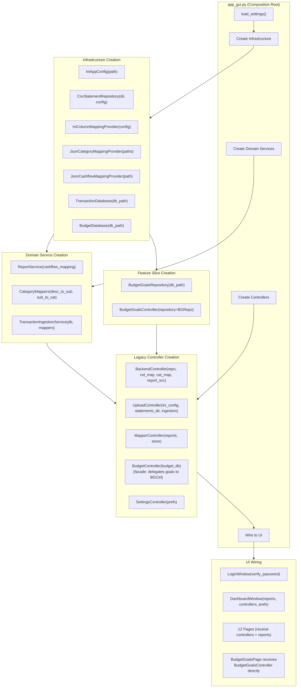

---

## 2. Database Schema

### 2.1 Transaction Database (`budget_analyser.db`)

#### Table: transactions

```sql
CREATE TABLE transactions (
    id INTEGER PRIMARY KEY AUTOINCREMENT,
    transaction_date TEXT NOT NULL,
    description TEXT NOT NULL,
    amount REAL NOT NULL,
    from_account TEXT NOT NULL,
    sub_category TEXT DEFAULT '',
    category TEXT DEFAULT '',
    c_or_d TEXT DEFAULT '',
    created_at TIMESTAMP DEFAULT CURRENT_TIMESTAMP,
    UNIQUE(transaction_date, description, amount, from_account)
);

CREATE INDEX idx_transaction_date ON transactions(transaction_date);
```

| Column | Type | Constraints | Description |
|--------|------|-------------|-------------|
| id | INTEGER | PRIMARY KEY, AUTOINCREMENT | Unique identifier |
| transaction_date | TEXT | NOT NULL | ISO date (YYYY-MM-DD) |
| description | TEXT | NOT NULL | Bank description |
| amount | REAL | NOT NULL | Signed amount |
| from_account | TEXT | NOT NULL | Account identifier |
| sub_category | TEXT | DEFAULT '' | Mapped sub-category |
| category | TEXT | DEFAULT '' | Parent category |
| c_or_d | TEXT | DEFAULT '' | "earnings" or "expenditures" |
| created_at | TIMESTAMP | DEFAULT CURRENT_TIMESTAMP | Record creation time |

**Unique Constraint:** `(transaction_date, description, amount, from_account)` prevents duplicate transactions.

### 2.2 Budget Database (`budget_goals.db`)

#### Table: budget_goals

```sql
CREATE TABLE budget_goals (
    id INTEGER PRIMARY KEY AUTOINCREMENT,
    category TEXT NOT NULL,
    monthly_limit REAL NOT NULL,
    year_month TEXT NOT NULL DEFAULT 'ALL',
    created_at TIMESTAMP DEFAULT CURRENT_TIMESTAMP,
    updated_at TIMESTAMP DEFAULT CURRENT_TIMESTAMP,
    UNIQUE(category, year_month)
);
```

#### Table: earnings_goals

```sql
CREATE TABLE earnings_goals (
    id INTEGER PRIMARY KEY AUTOINCREMENT,
    sub_category TEXT NOT NULL,
    expected_amount REAL NOT NULL,
    year_month TEXT NOT NULL DEFAULT 'ALL',
    created_at TIMESTAMP DEFAULT CURRENT_TIMESTAMP,
    updated_at TIMESTAMP DEFAULT CURRENT_TIMESTAMP,
    UNIQUE(sub_category, year_month)
);
```

#### Table: accounts

```sql
CREATE TABLE accounts (
    id INTEGER PRIMARY KEY AUTOINCREMENT,
    name TEXT NOT NULL UNIQUE,
    account_type TEXT NOT NULL,
    balance REAL NOT NULL DEFAULT 0,
    last_updated TEXT NOT NULL,
    notes TEXT DEFAULT '',
    created_at TIMESTAMP DEFAULT CURRENT_TIMESTAMP
);
```

**Valid account_type values:** `checking`, `savings`, `credit_card`, `investment`, `loan`, `other`

#### Table: recurring_transactions

```sql
CREATE TABLE recurring_transactions (
    id INTEGER PRIMARY KEY AUTOINCREMENT,
    description TEXT NOT NULL,
    expected_amount REAL NOT NULL,
    frequency TEXT NOT NULL DEFAULT 'monthly',
    category TEXT DEFAULT '',
    sub_category TEXT DEFAULT '',
    last_occurrence TEXT,
    is_active INTEGER DEFAULT 1,
    created_at TIMESTAMP DEFAULT CURRENT_TIMESTAMP,
    UNIQUE(description, expected_amount)
);
```

**Valid frequency values:** `weekly`, `monthly`, `quarterly`, `yearly`

### 2.3 Entity Relationship Diagram

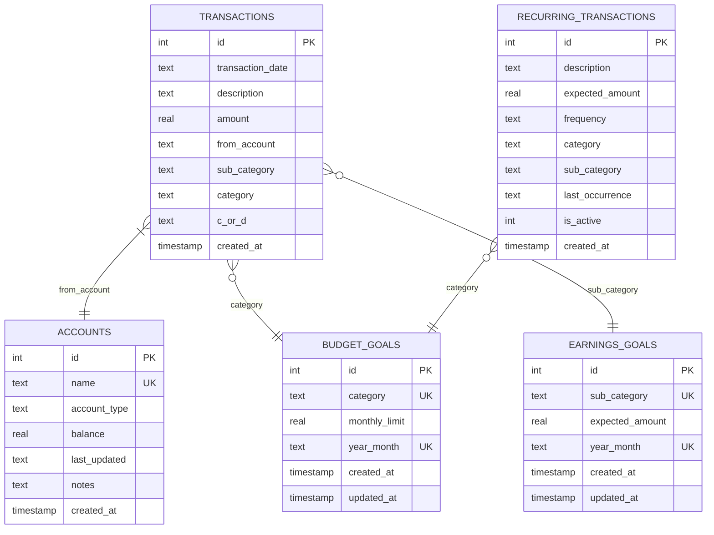

---

## 3. Key Algorithms

### 3.1 Transaction Categorization (Scored Keyword Matching)

The categorization process uses a **scored keyword matching** algorithm that ranks matches by specificity:

#### Scoring Formula

```
Base Score = len(keyword)                    # Longer keywords = more specific
Exact Bonus = 100.0 (if exact match)         # Exact matches win
Position Bonus = (len(content) - pos) / len(content) * 10  # Earlier = better
Weight Multiplier = per-mapping weight       # Configurable priority

Final Score = (base + exact_bonus + position_bonus) * weight
```

#### Three-Pass Categorization Flow

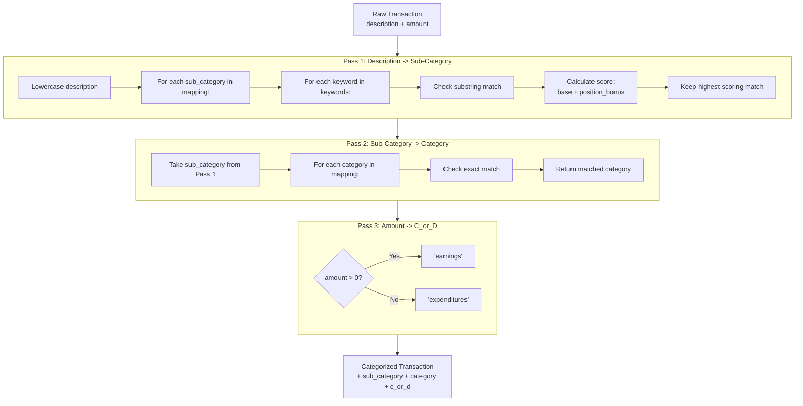

#### Categorization Sequence

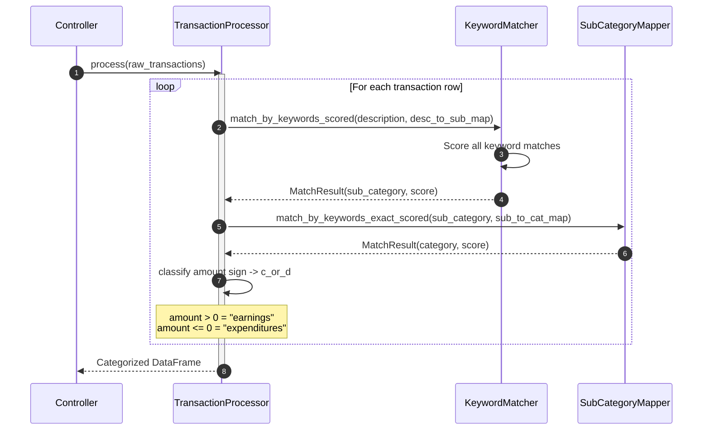

### 3.2 Statement Formatting (Template Method Pattern)

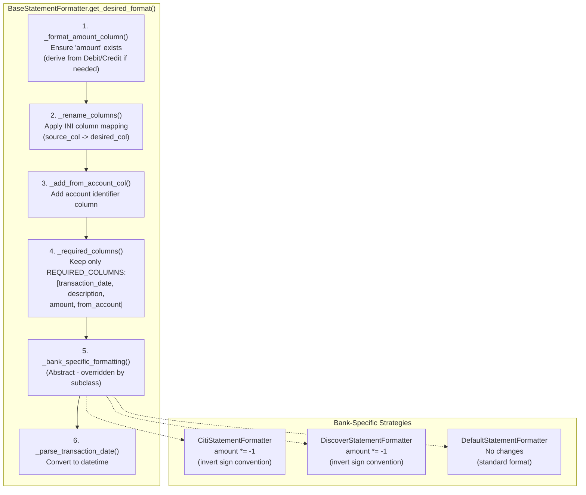

### 3.3 Duplicate Detection

Uses SQLite's `INSERT OR IGNORE` with unique constraint on `(transaction_date, description, amount, from_account)`:

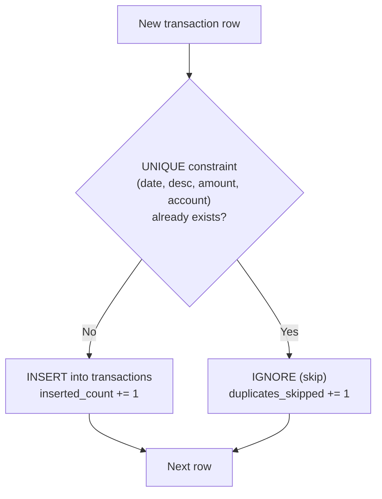

### 3.4 Recurring Transaction Detection

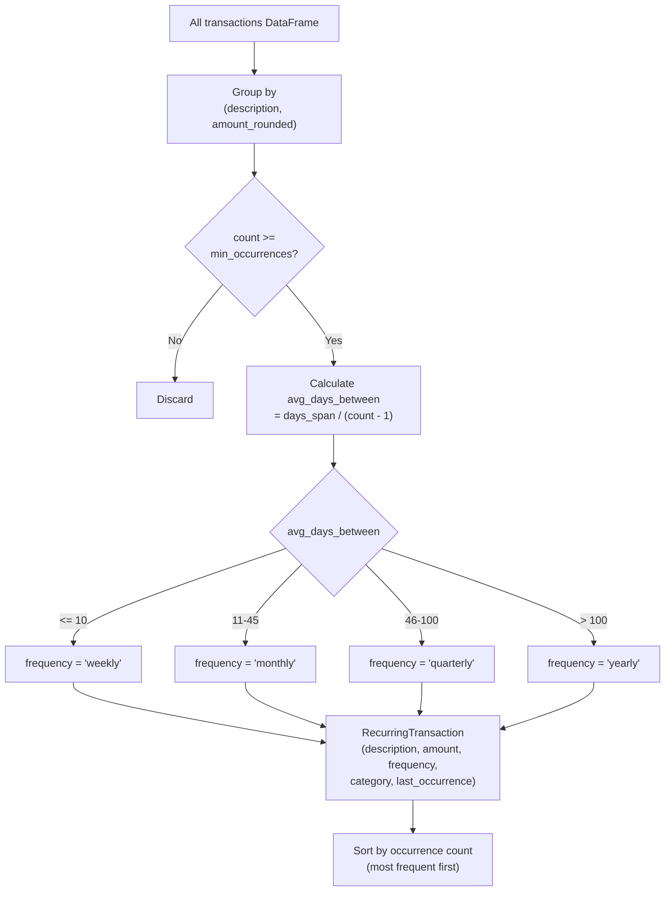

### 3.5 Burn Rate Analysis

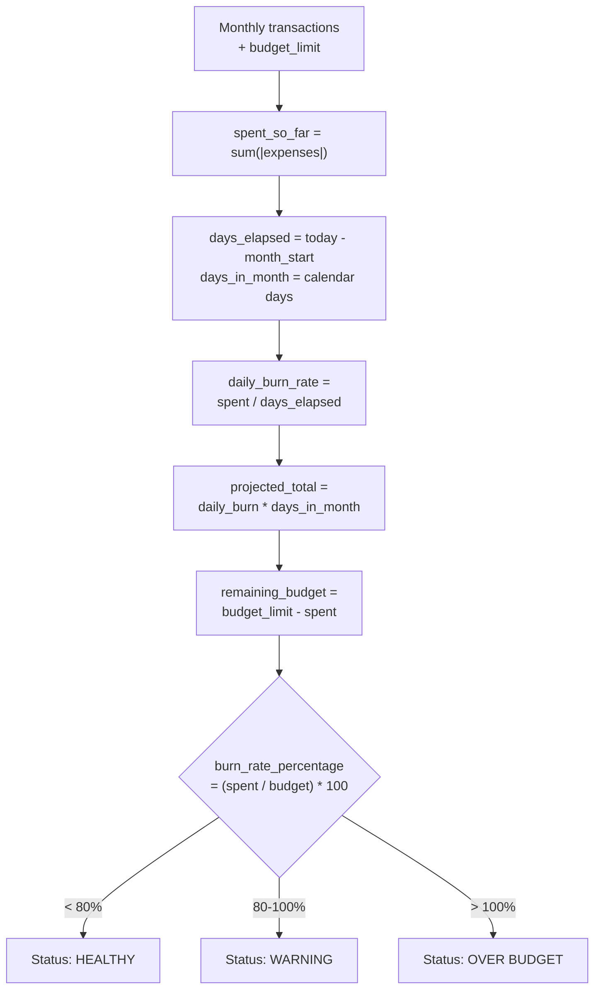

### 3.6 Expense Forecasting (Ensemble Method)

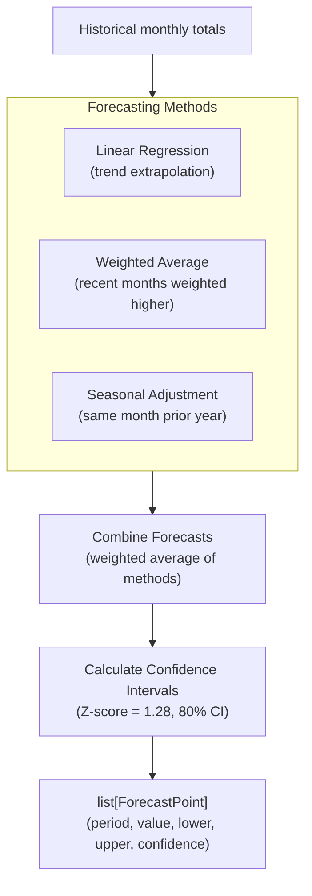

### 3.7 Trend Analysis

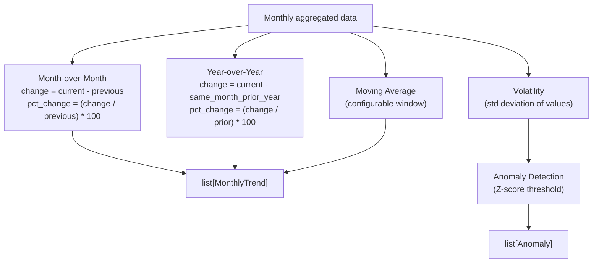

### 3.8 Spending Pattern Analysis (Pareto)

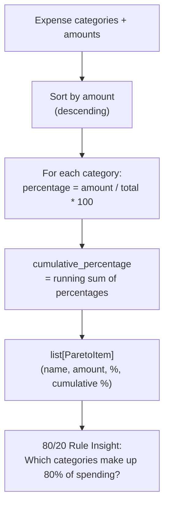

### 3.9 Payment Matching & Reconciliation

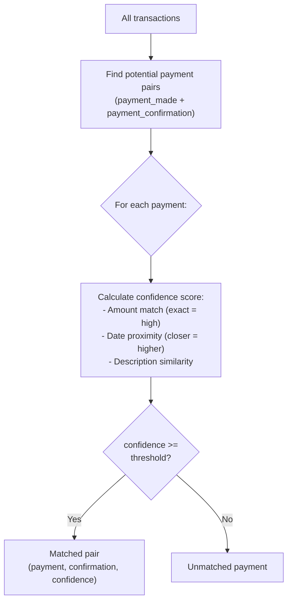

---

## 4. Interface Contracts

### 4.1 Protocol Definitions (`core/protocols.py`)

> Protocols live in `core/protocols.py`. Backward-compat shim in `domain/protocols.py` re-exports them.

```python
class StatementRepository(Protocol):
    """Repository to load raw statement DataFrames."""
    def get_statements(self) -> Mapping[str, pd.DataFrame]:
        """Returns {account_name: raw_DataFrame}."""
        ...

class ColumnMappingProvider(Protocol):
    """Provides per-account column rename mappings."""
    def get_column_mapping(self, account_name: str) -> Mapping[str, str]:
        """Returns {source_column: desired_column}."""
        ...

class CategoryMappingProvider(Protocol):
    """Provides keyword mappings for categorization."""
    def description_to_sub_category(self) -> Mapping[str, list[str]]:
        """Returns {sub_category: [keywords]}."""
        ...
    def sub_category_to_category(self) -> Mapping[str, list[str]]:
        """Returns {category: [sub_categories]}."""
        ...
```

### 4.2 Controller Method Signatures

#### BackendController

```python
class BackendController:
    def __init__(
        self, *,
        statement_repository: StatementRepository,
        column_mappings: ColumnMappingProvider,
        category_mappings: CategoryMappingProvider,
        report_service: ReportService,
        logger: logging.Logger
    ) -> None: ...

    def run(self) -> list[MonthlyReports]:
        """Full pipeline: load CSVs -> format -> categorize -> report."""

    def run_from_database(
        self, transactions: pd.DataFrame
    ) -> list[MonthlyReports]:
        """Generate reports from existing DB transactions."""
```

#### UploadController

```python
class UploadController:
    def __init__(
        self, *,
        logger: logging.Logger,
        ini_config: IniAppConfig,
        statements_dir: Path,
        ingestion_service: TransactionIngestionService | None
    ) -> None: ...

    def get_available_banks(self, account_type: str) -> list[str]: ...
    def get_missing_statements(self) -> list[tuple[str, str, str]]: ...
    def validate_csv(self, file_path: Path, account: str) -> UploadResult: ...
    def upload_csv(self, file_path: Path, account: str) -> UploadResult: ...
```

#### BudgetGoalsController (`features/budget_goals/controller.py`)

The primary controller for budget goal management. Used directly by `BudgetGoalsPage`.

```python
class BudgetGoalsController:
    def __init__(
        self, *,
        repository: BudgetGoalsRepository,
        logger: logging.Logger | None = None
    ) -> None: ...

    # Budget Goals
    def set_budget(self, category: str, monthly_limit: float,
                   year_month: str = "ALL") -> BudgetGoal: ...
    def get_budget(self, category: str,
                   year_month: str = "ALL") -> BudgetGoal | None: ...
    def get_all_budgets(self) -> list[BudgetGoal]: ...
    def delete_budget(self, category: str,
                      year_month: str = "ALL") -> bool: ...
    def set_budget_for_year(self, category: str, monthly_limit: float,
                            year: int) -> list[BudgetGoal]: ...

    # Earnings Goals
    def set_earnings_goal(self, sub_category: str, expected_amount: float,
                          year_month: str = "ALL") -> EarningsGoal: ...
    def get_earnings_goal(self, sub_category: str,
                          year_month: str = "ALL") -> EarningsGoal | None: ...
    def get_all_earnings_goals(self) -> list[EarningsGoal]: ...
    def delete_earnings_goal(self, sub_category: str,
                             year_month: str = "ALL") -> bool: ...
    def set_earnings_goal_for_year(self, sub_category: str,
                                   expected_amount: float,
                                   year: int) -> list[EarningsGoal]: ...
    def get_earnings_goal_map(self,
                              year_month: str = "ALL") -> dict[str, float]: ...

    # Budget Progress (delegates to service.py pure functions)
    def calculate_budget_progress(self, expenses_df: pd.DataFrame,
                                  year_month: str) -> list[BudgetProgress]: ...
    def get_categories_over_budget(self, expenses_df: pd.DataFrame,
                                   year_month: str) -> list[BudgetProgress]: ...
```

#### BudgetGoalsRepository (`features/budget_goals/repository.py`)

```python
class BudgetGoalsRepository:
    def __init__(self, db_path: Path,
                 logger: logging.Logger | None = None) -> None: ...

    # Budget Goals CRUD
    def set_budget_goal(self, category: str, monthly_limit: float,
                        year_month: str = "ALL") -> BudgetGoal: ...
    def get_budget_goal(self, category: str,
                        year_month: str = "ALL") -> BudgetGoal | None: ...
    def get_all_budget_goals(self) -> list[BudgetGoal]: ...
    def delete_budget_goal(self, category: str,
                           year_month: str = "ALL") -> bool: ...
    def set_budget_goals_for_year(self, category: str,
                                  monthly_limit: float,
                                  year: int) -> list[BudgetGoal]: ...

    # Earnings Goals CRUD
    def set_earnings_goal(self, sub_category: str, expected_amount: float,
                          year_month: str = "ALL") -> EarningsGoal: ...
    def get_earnings_goal(self, sub_category: str,
                          year_month: str = "ALL") -> EarningsGoal | None: ...
    def get_all_earnings_goals(self) -> list[EarningsGoal]: ...
    def delete_earnings_goal(self, sub_category: str,
                             year_month: str = "ALL") -> bool: ...
    def set_earnings_goals_for_year(self, sub_category: str,
                                    expected_amount: float,
                                    year: int) -> list[EarningsGoal]: ...
```

#### BudgetGoals Service Functions (`features/budget_goals/service.py`)

```python
def calculate_budget_progress(
    *, budgets: list[BudgetGoal],
    expenses_df: pd.DataFrame,
    year_month: str,
) -> list[BudgetProgress]:
    """Calculate budget progress for all categories in a given month."""

def build_earnings_goal_map(
    *, goals: list[EarningsGoal],
    year_month: str = "ALL",
) -> dict[str, float]:
    """Build sub-category -> expected amount mapping. Month-specific overrides ALL."""
```

#### BudgetController (`controller/budget_controller.py` — legacy facade)

Backward-compatibility facade. Budget/earnings goal methods delegate to `features.budget_goals`.
Savings, net worth, and recurring methods remain here until their features are migrated.

```python
class BudgetController:
    def __init__(self, budget_db: BudgetDatabase,
                 logger: logging.Logger | None = None) -> None: ...

    # Budget/Earnings Goals (delegates to features.budget_goals)
    def set_budget(...) -> BudgetGoal: ...
    def get_earnings_goal_map(year_month) -> dict[str, float]: ...
    def calculate_budget_progress(expenses_df, year_month) -> list[BudgetProgress]: ...

    # Savings (pending migration to features/savings/)
    def calculate_savings_metrics(self, earnings_df: pd.DataFrame,
                                  expenses_df: pd.DataFrame,
                                  year: int | None = None) -> SavingsMetrics: ...
    def calculate_monthly_savings(self, earnings_df: pd.DataFrame,
                                  expenses_df: pd.DataFrame,
                                  year: int) -> list[tuple]: ...

    # Net Worth (pending migration to features/net_worth/)
    def add_account(self, name: str, account_type: str,
                    balance: float = 0, notes: str = "") -> Account: ...
    def get_net_worth_summary(self) -> NetWorthSummary: ...

    # Recurring (pending migration to features/recurring/)
    def add_recurring_transaction(...) -> RecurringTransaction: ...
    def get_all_recurring_transactions(active_only: bool) -> list[RecurringTransaction]: ...
    def get_recurring_summary(transactions_df) -> dict[str, float]: ...
    def check_recurring_anomalies(transactions_df, tolerance_percent) -> list[dict]: ...
```

#### MapperController

```python
@dataclass
class MapperController:
    reports: list[MonthlyReports]
    logger: logging.Logger
    store: JsonCategoryMappingStore

    def reload(self) -> None: ...
    def list_unmapped_transactions(self) -> pd.DataFrame: ...
    def list_unmapped_descriptions(self) -> list[str]: ...
    def add_mapping(self, description: str, sub_category: str) -> bool: ...
    def update_mapping(self, description: str, sub_category: str) -> bool: ...
    def save(self) -> None: ...
```

---

## 5. Configuration Management

### 5.1 Settings Loading Flow

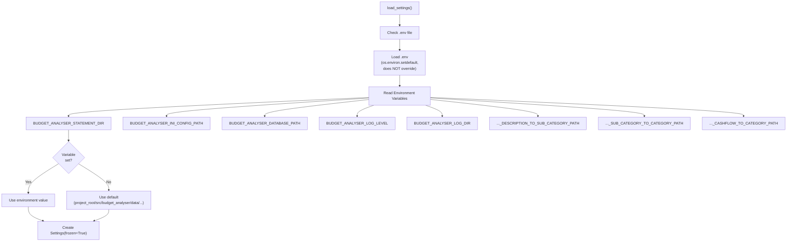

### 5.2 INI Configuration Structure

```ini
[credit_cards]
bilt = bilt_credit.csv
chase = chase_credit.csv
citi = citi_credit.csv
discover = discover_credit.csv

[checking_accounts]
chase_account = chase_debit.csv

[chase_map]
transaction_date = Transaction Date
description = Description
amount = Amount

[citi_map]
transaction_date = Date
description = Description
amount = amount

[discover_map]
transaction_date = Trans. Date
description = Description
amount = Amount

[bilt_map]
transaction_date = Date
description = description
amount = amount

[chase_account_map]
transaction_date = Details
description = Posting Date
amount = Description

[app]
log_level = DEBUG
password_hash = sha256$<salt_hex>$<hash_hex>
theme = dark
```

**Parsing Rules:**
- Section `[{account}_map]` provides column mappings: `desired_col = source_csv_col`
- INI parser disables interpolation (`interpolation=None`) to avoid `%(x)s` injection
- `[app]` section stores runtime preferences (log level, theme, password hash)

### 5.3 JSON Mapping Formats

**description_to_sub_category.json:**
```json
{
  "Groceries": ["SAFEWAY", "COSTCO", "TRADER JOE", "WHOLE FOODS"],
  "Utilities": ["PG&E", "COMCAST", "AT&T"],
  "Restaurants": ["DOORDASH", "UBER EATS", "GRUBHUB"],
  "payments_made": ["APPLECARD GSBANK PAYMENT", "APPLE.COM/BILL"]
}
```

**sub_category_to_category.json:**
```json
{
  "Needs": ["Groceries", "Utilities", "House-Rent", "Insurance", "Gas"],
  "Flexible": ["Transportation", "Medical", "Grooming", "Growth"],
  "Luxuries": ["Restaurants", "Shopping", "Travel", "Entertainment", "Subscriptions"],
  "Income": ["Paycheck", "Bonus"],
  "Unplanned_income": ["Refund", "Cashback"]
}
```

**cashflow_to_category.json:**
```json
{
  "Earnings": ["Income", "Unplanned_income"],
  "Expenses": ["Needs", "Flexible", "Luxuries", "Remittance", "Unplanned_Spending's"]
}
```

---

## 6. Error Handling

### 6.1 Domain Exception Hierarchy (`core/errors.py`)

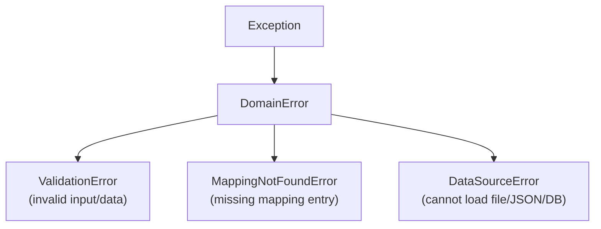

### 6.2 Error Handling Patterns

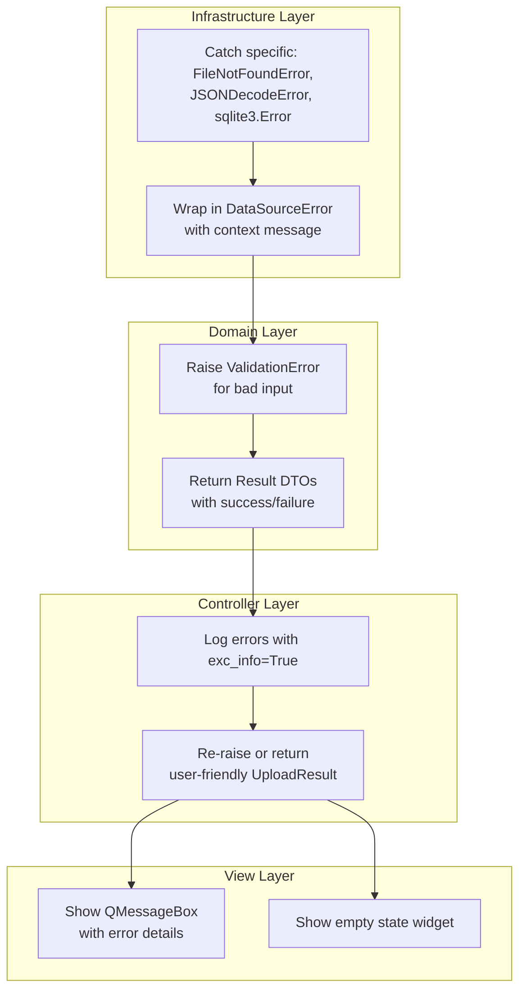

---

## 7. Logging Strategy

### 7.1 Logger Configuration

```python
# Format
FORMAT = "%(asctime)s | %(levelname).4s | %(name)s | %(filename)s:%(lineno)d | %(message)s"

# File handler with rotation
handler = RotatingFileHandler(
    filename="data/logs/gui_app.log",
    maxBytes=5 * 1024 * 1024,  # 5 MB
    backupCount=3               # gui_app.log, .1, .2, .3
)
```

### 7.2 Log Levels Usage

| Level | Usage |
|-------|-------|
| DEBUG | Detailed diagnostics (mapping scores, DataFrame shapes, column transforms) |
| INFO | Operational milestones (files loaded, N records processed, reports generated) |
| WARNING | Potentially problematic (empty mappings, missing columns, NaN values) |
| ERROR | Error conditions (file not found, parse errors, DB failures) |

---

## 8. GUI Component Architecture

### 8.1 Widget Hierarchy

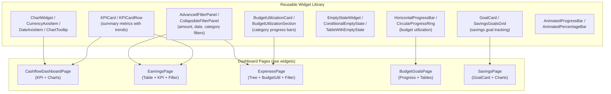

### 8.2 Page State Management

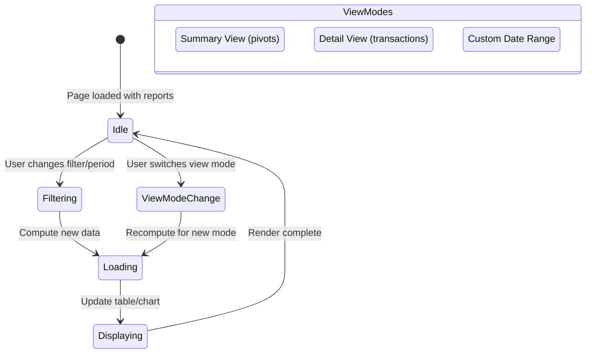

### 8.3 Signal/Slot Connections

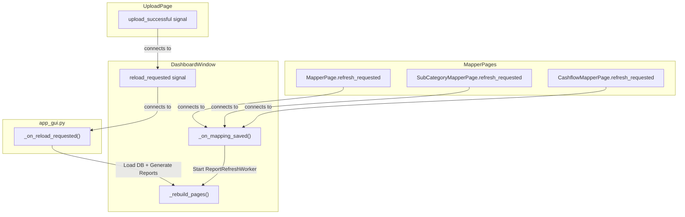

---

## 9. File Formats

### 9.1 CSV Statement Format

**Expected Input (varies by bank):**
```csv
Transaction Date,Description,Amount
2024-01-15,SAFEWAY STORE #1234,-125.43
2024-01-16,EMPLOYER DIRECT DEP,2500.00
```

**Normalization to Canonical Schema:**

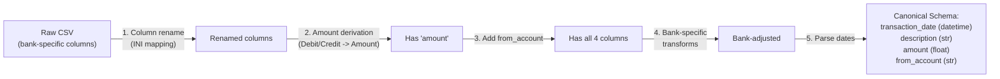

### 9.2 Atomic JSON Write

```mermaid
flowchart TD
    Start["save(mapping, path)"] --> WriteTmp["Write to path.tmp<br/>(json.dump with indent=2)"]
    WriteTmp --> Rename["tmp.replace(path)<br/>(atomic on POSIX)"]
    Rename -->|Success| Done["File updated atomically"]
    WriteTmp -->|Error| Cleanup["Delete .tmp if exists"]
    Cleanup --> Reraise["Re-raise exception"]
```

---

## 10. Statement Formatter Implementation

### 10.1 Factory Pattern

```mermaid
flowchart TD
    Call["create_statement_formatter<br/>(account_name, statement, mapping)"]
    Call --> Check{"account_name<br/>contains?"}
    Check -->|"'citi'"| Citi["CitiStatementFormatter<br/>(inverts amount signs)"]
    Check -->|"'discover'"| Discover["DiscoverStatementFormatter<br/>(inverts amount signs)"]
    Check -->|other| Default["DefaultStatementFormatter<br/>(no changes)"]
```

### 10.2 Base Class Template Method

```python
class BaseStatementFormatter(ABC):
    REQUIRED_COLUMNS = ["transaction_date", "description", "amount", "from_account"]

    def __init__(self, *, account_name: str, statement: pd.DataFrame,
                 column_mapping: Mapping[str, str]) -> None:
        self._account_name = account_name
        self._statement = statement.copy()
        self._column_mapping = column_mapping

    def get_desired_format(self) -> pd.DataFrame:
        self._format_amount_column()        # Step 1
        self._rename_columns()              # Step 2
        self._add_from_account_col()        # Step 3
        self._validate_required_columns()   # Step 4
        self._bank_specific_formatting()    # Step 5 (abstract hook)
        self._parse_transaction_date()      # Step 6
        return self._statement

    @abstractmethod
    def _bank_specific_formatting(self) -> None:
        """Override for bank-specific adjustments."""
```

---

## 11. Report Pivoting

### 11.1 Monthly Report Generation

```mermaid
flowchart TD
    AllTx["All categorized transactions"]
    AllTx --> AddPeriod["Add year_month column<br/>(YYYY-MM)"]
    AddPeriod --> GroupBy["Group by year_month"]

    GroupBy --> ForEach["For each month:"]

    ForEach --> Earnings["earnings = filter<br/>(category IN earnings_cats<br/>AND amount > 0)"]
    ForEach --> Expenses["expenses = filter<br/>(category IN expense_cats<br/>OR amount < 0)"]

    Expenses --> PivotCat["expenses_category =<br/>pivot_table(index=category,<br/>values=amount, aggfunc=sum)"]
    Expenses --> PivotSub["expenses_sub_category =<br/>pivot_table(index=sub_category,<br/>values=amount, aggfunc=sum)"]

    Earnings --> MR["MonthlyReports(<br/>month, earnings, expenses,<br/>expenses_category,<br/>expenses_sub_category,<br/>transactions)"]
    PivotCat --> MR
    PivotSub --> MR
```

---

## 12. Security Implementation

### 12.1 Password Hashing

```mermaid
flowchart TD
    subgraph SetPassword["set_password(plain_text)"]
        Gen["Generate 32-byte random salt<br/>(os.urandom(32))"]
        Hash["SHA-256(salt + plain_text.encode())"]
        Format["Format: sha256$salt_hex$hash_hex"]
        Store["Store in INI [app] section"]
        Gen --> Hash --> Format --> Store
    end

    subgraph VerifyPassword["verify_password(plain_text)"]
        Read["Read stored hash from INI"]
        Parse["Parse: algo$salt$expected_hash"]
        Recompute["SHA-256(salt_bytes + plain_text.encode())"]
        Compare{"computed_hash<br/>== expected_hash?"}
        Parse --> Recompute --> Compare
        Compare -->|Yes| OK["Return True"]
        Compare -->|No| Fail["Return False"]
    end
```

### 12.2 SQL Injection Prevention

All database operations use parameterized queries:

```python
# SAFE: Parameterized query
cursor.execute(
    "INSERT OR IGNORE INTO transactions "
    "(transaction_date, description, amount, from_account, "
    " sub_category, category, c_or_d) VALUES (?, ?, ?, ?, ?, ?, ?)",
    (date, desc, amount, account, sub_cat, cat, c_or_d)
)
```

---

## 13. Data File Layout

```
src/budget_analyser/data/
├── config/
│   └── budget_analyser.ini        # Account configs, column maps, app prefs
├── mappers/
│   ├── description_to_sub_category.json   # Keyword -> sub-category mappings
│   ├── sub_category_to_category.json      # Sub-category -> category mappings
│   └── cashflow_to_category.json          # Category -> earnings/expenses
├── statements/
│   ├── bilt_credit.csv            # User-uploaded bank CSVs
│   ├── chase_credit.csv
│   ├── chase_debit.csv
│   ├── citi_credit.csv
│   └── discover_credit.csv
├── logs/
│   └── gui_app.log                # Rotating log (5MB x 3 backups)
├── budget_analyser.db             # SQLite: transactions
└── budget_goals.db                # SQLite: budgets, goals, accounts, recurring
```

---

## 14. CI/CD Pipeline

```mermaid
flowchart LR
    subgraph Triggers["Triggers"]
        Push["Push to main"]
        PR["Pull Request"]
    end

    subgraph TestWorkflow["tests.yml"]
        Matrix["Matrix: 3 OS x 3 Python versions<br/>(Ubuntu, macOS, Windows)<br/>(Python 3.10, 3.11, 3.12)"]
        Install["pip install -r requirements.txt"]
        Test["pytest -q"]
        Matrix --> Install --> Test
    end

    subgraph LintWorkflow["pylint.yml"]
        Lint["pylint src/budget_analyser<br/>(views/ exempted)"]
    end

    subgraph ReleaseWorkflow["release.yml (main only)"]
        Version["Auto version tag<br/>(patch increment)"]
        Changelog["Generate changelog<br/>(commits since last tag)"]
        BuildWin["PyInstaller Windows .exe"]
        BuildMacI["PyInstaller macOS Intel"]
        BuildMacA["PyInstaller macOS ARM"]
        Release["GitHub Release<br/>with all artifacts"]

        Version --> Changelog
        Changelog --> BuildWin
        Changelog --> BuildMacI
        Changelog --> BuildMacA
        BuildWin --> Release
        BuildMacI --> Release
        BuildMacA --> Release
    end

    Push --> TestWorkflow
    Push --> LintWorkflow
    Push --> ReleaseWorkflow
    PR --> TestWorkflow
    PR --> LintWorkflow
```

---

## 15. Testing Architecture

### 15.1 Test Organization

```
tests/
├── conftest.py              # Adds src/ to PYTHONPATH
├── unit/                    # Fast, isolated (mock dependencies)
│   ├── domain/             # Business logic tests
│   │   ├── test_keyword_matching.py              (39 tests)
│   │   ├── test_trend_analysis.py                (22 tests)
│   │   ├── test_burn_rate.py                     (18 tests)
│   │   ├── test_forecasting.py
│   │   ├── test_spending_patterns.py
│   │   ├── test_payment_matching.py              (17 tests)
│   │   ├── test_categorization_suggestions.py    (20 tests)
│   │   ├── test_transaction_processor_mapping.py
│   │   └── test_statement_formatter.py
│   ├── controller/         # Controller tests
│   │   ├── test_budget_controller.py     (legacy facade, 1 test)
│   │   ├── test_earnings_controller.py
│   │   ├── test_expenses_controller.py
│   │   └── test_dashboard_controller.py
│   ├── feature_slices/     # Feature slice tests
│   │   ├── test_budget_goals_service.py      (14 tests - pure functions)
│   │   ├── test_budget_goals_repository.py   (16 tests - SQLite CRUD)
│   │   └── test_budget_goals_controller.py   (7 tests - integration)
│   └── infrastructure/     # (needs expansion)
│       └── test_preferences.py
├── integration/            # (planned)
└── system/                 # (planned)
```

### 15.2 Test Execution Pipeline

```mermaid
flowchart LR
    subgraph Dev["Developer (Before Commit)"]
        Unit["pytest tests/unit/ -q<br/>(~328 tests, < 30s)"]
    end

    subgraph CI["CI Pipeline"]
        AllUnit["Unit Tests"]
        Integration["Integration Tests<br/>(planned)"]
        System["System Tests<br/>(planned)"]
        Lint["pylint"]
        AllUnit --> Integration --> System --> Lint
    end

    Dev --> CI
```
