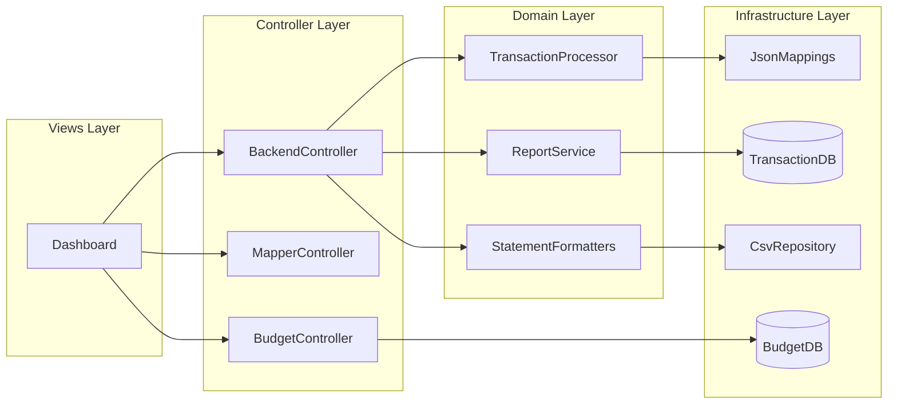
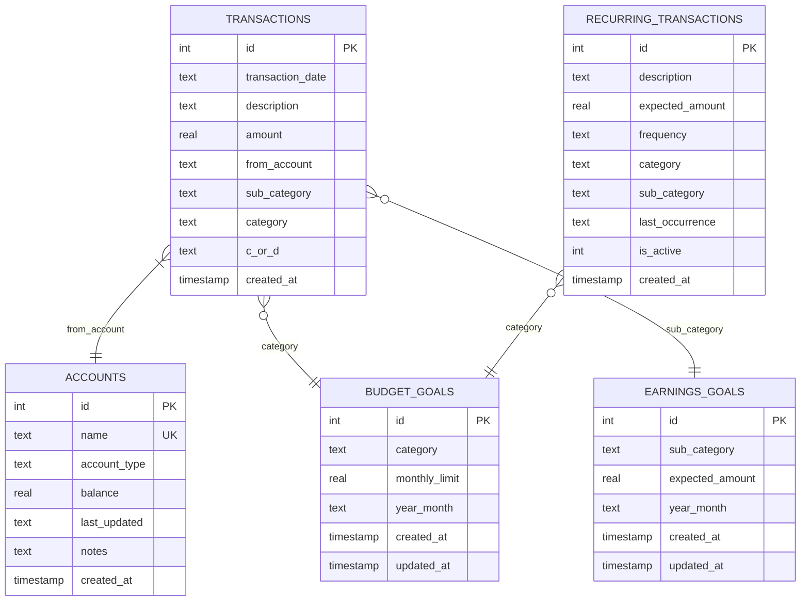
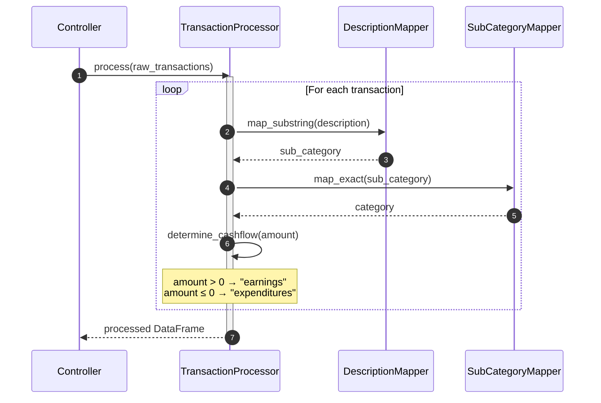

# Low-Level Design (LLD) - Budget Analyser

## 1. Class Structures and Relationships

### 1.1 Domain Models

#### TransactionRecord

```python
@dataclass
class TransactionRecord:
    transaction_date: str      # ISO date format (YYYY-MM-DD)
    description: str           # Bank description text
    amount: float             # Signed: positive=earnings, negative=expenses
    from_account: str         # Account identifier
    sub_category: str = ""    # Keyword-matched sub-category
    category: str = ""        # Parent category
    c_or_d: str = ""          # "earnings" or "expenditures"
```

#### MonthlyReports

```python
@dataclass(frozen=True)
class MonthlyReports:
    month: pd.Period                    # Period object (e.g., 2024-01)
    earnings: pd.DataFrame              # Earnings with amounts
    expenses: pd.DataFrame              # Expenses with amounts
    expenses_category: pd.DataFrame     # Category → amount pivot
    expenses_sub_category: pd.DataFrame # Sub-category → amount pivot
    transactions: pd.DataFrame          # Full month's transactions
```

#### Budget Domain Models

```python
@dataclass
class BudgetGoal:
    id: Optional[int]
    category: str
    monthly_limit: float
    year_month: str  # "YYYY-MM" or "ALL" for default

@dataclass
class EarningsGoal:
    id: Optional[int]
    sub_category: str
    expected_amount: float
    year_month: str

@dataclass
class Account:
    id: Optional[int]
    name: str
    account_type: str  # "checking", "savings", "credit_card", "investment", "loan"
    balance: float
    last_updated: str  # ISO date
    notes: str = ""

@dataclass
class RecurringTransaction:
    id: Optional[int]
    description: str
    expected_amount: float
    frequency: str  # "monthly", "weekly", "yearly", "quarterly"
    category: str
    sub_category: str
    last_occurrence: str  # ISO date
    is_active: bool = True
```

#### Result DTOs

```python
@dataclass(frozen=True)
class UploadResult:
    success: bool
    message: str
    destination_path: str | None = None
    transactions_inserted: int = 0
    duplicates_skipped: int = 0

@dataclass
class IngestionResult:
    success: bool
    message: str
    transactions_processed: int = 0
    transactions_inserted: int = 0
    duplicates_skipped: int = 0
```

### 1.2 Class Relationships

```mermaid
classDiagram
    direction TB

    %% Protocols (Interfaces)
    class StatementRepository {
        <<protocol>>
        +get_statements() Mapping
    }

    class ColumnMappingProvider {
        <<protocol>>
        +get_column_mapping(account) Mapping
    }

    class CategoryMappingProvider {
        <<protocol>>
        +description_to_sub_category() Mapping
        +sub_category_to_category() Mapping
    }

    %% Infrastructure Implementations
    class CsvStatementRepository {
        +get_statements() Mapping
    }

    class IniColumnMappingProvider {
        +get_column_mapping(account) Mapping
    }

    class JsonCategoryMappingProvider {
        +description_to_sub_category() Mapping
        +sub_category_to_category() Mapping
    }

    class TransactionDatabase {
        +insert_transactions(df) int
        +get_all_transactions() DataFrame
        +has_transactions() bool
    }

    class BudgetDatabase {
        +set_budget_goal(goal) BudgetGoal
        +get_budget_goal(category) BudgetGoal
        +add_account(account) Account
    }

    %% Domain Services
    class TransactionProcessor {
        -_mappers: CategoryMappers
        +process(raw_transactions) DataFrame
    }

    class ReportService {
        +earnings(statement) DataFrame
        +expenses(statement) DataFrame
        +expenses_category(statement) DataFrame
    }

    class BaseStatementFormatter {
        <<abstract>>
        +get_desired_format() DataFrame
        #_bank_specific_formatting()*
    }

    class CitiStatementFormatter {
        #_bank_specific_formatting()
    }

    class DiscoverStatementFormatter {
        #_bank_specific_formatting()
    }

    class DefaultStatementFormatter {
        #_bank_specific_formatting()
    }

    %% Controllers
    class BackendController {
        -_statement_repository: StatementRepository
        -_column_mappings: ColumnMappingProvider
        -_category_mappings: CategoryMappingProvider
        -_report_service: ReportService
        +run() List~MonthlyReports~
    }

    class MapperController {
        -reports: List~MonthlyReports~
        -store: JsonCategoryMappingStore
        +list_unmapped_transactions() DataFrame
        +add_mapping(desc, subcat) bool
    }

    class BudgetController {
        -budget_db: BudgetDatabase
        +set_budget(category, limit) BudgetGoal
        +get_net_worth() dict
    }

    %% Relationships
    StatementRepository <|.. CsvStatementRepository : implements
    ColumnMappingProvider <|.. IniColumnMappingProvider : implements
    CategoryMappingProvider <|.. JsonCategoryMappingProvider : implements

    BaseStatementFormatter <|-- CitiStatementFormatter : extends
    BaseStatementFormatter <|-- DiscoverStatementFormatter : extends
    BaseStatementFormatter <|-- DefaultStatementFormatter : extends

    BackendController --> StatementRepository : uses
    BackendController --> ColumnMappingProvider : uses
    BackendController --> CategoryMappingProvider : uses
    BackendController --> ReportService : uses

    BudgetController --> BudgetDatabase : uses
    TransactionProcessor --> CategoryMappingProvider : uses
```



### 1.3 Dependency Flow



---

## 2. Database Schema

### 2.1 Transaction Database (`budget_analyser.db`)

#### Table: transactions

```sql
CREATE TABLE transactions (
    id INTEGER PRIMARY KEY AUTOINCREMENT,
    transaction_date TEXT NOT NULL,
    description TEXT NOT NULL,
    amount REAL NOT NULL,
    from_account TEXT NOT NULL,
    sub_category TEXT DEFAULT '',
    category TEXT DEFAULT '',
    c_or_d TEXT DEFAULT '',
    created_at TIMESTAMP DEFAULT CURRENT_TIMESTAMP,
    UNIQUE(transaction_date, description, amount, from_account)
);

CREATE INDEX idx_transaction_date ON transactions(transaction_date);
```

| Column | Type | Constraints | Description |
|--------|------|-------------|-------------|
| id | INTEGER | PRIMARY KEY, AUTOINCREMENT | Unique identifier |
| transaction_date | TEXT | NOT NULL | ISO date (YYYY-MM-DD) |
| description | TEXT | NOT NULL | Bank description |
| amount | REAL | NOT NULL | Signed amount |
| from_account | TEXT | NOT NULL | Account identifier |
| sub_category | TEXT | DEFAULT '' | Mapped sub-category |
| category | TEXT | DEFAULT '' | Parent category |
| c_or_d | TEXT | DEFAULT '' | "earnings" or "expenditures" |
| created_at | TIMESTAMP | DEFAULT CURRENT_TIMESTAMP | Record creation time |

**Unique Constraint:** `(transaction_date, description, amount, from_account)` prevents duplicate transactions.

### 2.2 Budget Database (`budget_goals.db`)

#### Table: budget_goals

```sql
CREATE TABLE budget_goals (
    id INTEGER PRIMARY KEY AUTOINCREMENT,
    category TEXT NOT NULL,
    monthly_limit REAL NOT NULL,
    year_month TEXT NOT NULL DEFAULT 'ALL',
    created_at TIMESTAMP DEFAULT CURRENT_TIMESTAMP,
    updated_at TIMESTAMP DEFAULT CURRENT_TIMESTAMP,
    UNIQUE(category, year_month)
);
```

#### Table: earnings_goals

```sql
CREATE TABLE earnings_goals (
    id INTEGER PRIMARY KEY AUTOINCREMENT,
    sub_category TEXT NOT NULL,
    expected_amount REAL NOT NULL,
    year_month TEXT NOT NULL DEFAULT 'ALL',
    created_at TIMESTAMP DEFAULT CURRENT_TIMESTAMP,
    updated_at TIMESTAMP DEFAULT CURRENT_TIMESTAMP,
    UNIQUE(sub_category, year_month)
);
```

#### Table: accounts

```sql
CREATE TABLE accounts (
    id INTEGER PRIMARY KEY AUTOINCREMENT,
    name TEXT NOT NULL UNIQUE,
    account_type TEXT NOT NULL,
    balance REAL NOT NULL DEFAULT 0,
    last_updated TEXT NOT NULL,
    notes TEXT DEFAULT '',
    created_at TIMESTAMP DEFAULT CURRENT_TIMESTAMP
);
```

**Valid account_type values:** `checking`, `savings`, `credit_card`, `investment`, `loan`, `other`

#### Table: recurring_transactions

```sql
CREATE TABLE recurring_transactions (
    id INTEGER PRIMARY KEY AUTOINCREMENT,
    description TEXT NOT NULL,
    expected_amount REAL NOT NULL,
    frequency TEXT NOT NULL DEFAULT 'monthly',
    category TEXT DEFAULT '',
    sub_category TEXT DEFAULT '',
    last_occurrence TEXT,
    is_active INTEGER DEFAULT 1,
    created_at TIMESTAMP DEFAULT CURRENT_TIMESTAMP,
    UNIQUE(description, expected_amount)
);
```

**Valid frequency values:** `weekly`, `monthly`, `quarterly`, `yearly`

### 2.3 Entity Relationship Diagram



---

## 3. Key Algorithms

### 3.1 Transaction Categorization

The categorization process applies keyword mappings in two passes:

#### Pass 1: Description → Sub-Category (Substring Matching)

```python
def _map_by_keywords_substring(content: str, keyword_map: Mapping[str, list[str]]) -> str:
    """
    Finds first keyword that appears as substring in content.
    Case-insensitive matching.
    """
    content_lower = content.lower()
    for mapped_value, keywords in keyword_map.items():
        for keyword in keywords:
            if str(keyword).lower() in content_lower:
                return mapped_value  # First match wins
    return ""  # No match found
```

**Example:**
- Input: `"SAFEWAY STORE #1234 PAYMENT"`
- Keyword map: `{"Groceries": ["SAFEWAY", "COSTCO"]}`
- Output: `"Groceries"` (substring "safeway" found)

#### Pass 2: Sub-Category → Category (Exact Matching)

```python
def _map_by_keywords_exact(content: str, keyword_map: Mapping[str, list[str]]) -> str:
    """
    Finds exact match of content in keyword lists.
    Case-insensitive matching.
    """
    content_lower = content.lower()
    for mapped_value, keywords in keyword_map.items():
        for keyword in keywords:
            if content_lower == str(keyword).lower():
                return mapped_value  # Exact match required
    return ""
```

**Example:**
- Input: `"Groceries"`
- Keyword map: `{"Needs": ["Groceries", "Utilities"]}`
- Output: `"Needs"` (exact match)

#### Pass 3: Amount → C_or_D (Sign-Based)

```python
def _determine_cashflow(amount: float) -> str:
    return "earnings" if amount > 0 else "expenditures"
```

#### Full Process Flow

```python
def process(self, *, raw_transactions: pd.DataFrame) -> pd.DataFrame:
    processed = raw_transactions.copy()

    # Pass 1: description → sub_category
    processed["sub_category"] = processed["description"].map(
        lambda d: _map_by_keywords_substring(d, self._mappers.description_to_sub_category)
    )

    # Pass 2: sub_category → category
    processed["category"] = processed["sub_category"].map(
        lambda s: _map_by_keywords_exact(s, self._mappers.sub_category_to_category)
    )

    # Pass 3: amount → c_or_d
    processed["c_or_d"] = processed["amount"].map(
        lambda a: "earnings" if a > 0 else "expenditures"
    )

    return processed
```

#### Categorization Sequence Diagram



### 3.2 Duplicate Detection

Uses SQLite's `INSERT OR IGNORE` with unique constraint:

```python
def insert_transactions(self, transactions: pd.DataFrame) -> int:
    """
    Inserts transactions, ignoring duplicates.
    Returns count of successfully inserted rows.
    """
    cursor = self._conn.cursor()
    inserted = 0

    for _, row in transactions.iterrows():
        try:
            cursor.execute("""
                INSERT OR IGNORE INTO transactions
                (transaction_date, description, amount, from_account,
                 sub_category, category, c_or_d)
                VALUES (?, ?, ?, ?, ?, ?, ?)
            """, (
                row["transaction_date"].strftime("%Y-%m-%d"),
                row["description"],
                row["amount"],
                row["from_account"],
                row.get("sub_category", ""),
                row.get("category", ""),
                row.get("c_or_d", "")
            ))
            if cursor.rowcount > 0:
                inserted += 1
        except sqlite3.Error:
            pass  # Constraint violation, skip

    self._conn.commit()
    return inserted
```

**Duplicate criteria:** Same `(transaction_date, description, amount, from_account)`

### 3.3 Recurring Transaction Detection

```python
def detect_recurring_transactions(
    self,
    transactions_df: pd.DataFrame,
    min_occurrences: int = 2
) -> List[dict]:
    """
    Detects potentially recurring transactions based on description and amount patterns.
    """
    df = transactions_df.copy()
    df["transaction_date"] = pd.to_datetime(df["transaction_date"])

    # Round amounts to handle small variations (e.g., $9.99 vs $10.00)
    df["amount_rounded"] = df["amount"].round(2)

    # Group by (description, rounded_amount)
    grouped = df.groupby(["description", "amount_rounded"]).agg({
        "transaction_date": ["count", "min", "max"],
        "category": "first",
        "sub_category": "first"
    }).reset_index()

    # Flatten column names
    grouped.columns = [
        "description", "amount", "count",
        "first_date", "last_date", "category", "sub_category"
    ]

    # Filter to transactions appearing >= min_occurrences times
    recurring = grouped[grouped["count"] >= min_occurrences].copy()

    # Estimate frequency based on date intervals
    results = []
    for _, row in recurring.iterrows():
        days_span = (row["last_date"] - row["first_date"]).days
        if row["count"] > 1:
            avg_days_between = days_span / (row["count"] - 1)
        else:
            avg_days_between = 0

        # Determine frequency
        if avg_days_between <= 10:
            frequency = "weekly"
        elif avg_days_between <= 45:
            frequency = "monthly"
        elif avg_days_between <= 100:
            frequency = "quarterly"
        else:
            frequency = "yearly"

        results.append({
            "description": row["description"],
            "expected_amount": row["amount"],
            "frequency": frequency,
            "category": row["category"] or "",
            "sub_category": row["sub_category"] or "",
            "occurrences": row["count"],
            "last_occurrence": row["last_date"].strftime("%Y-%m-%d")
        })

    # Sort by occurrence count (most frequent first)
    return sorted(results, key=lambda x: x["occurrences"], reverse=True)
```

### 3.4 Report Pivoting

#### Expenses by Category

```python
def expenses_category(self, *, statement: pd.DataFrame) -> pd.DataFrame:
    """
    Generates category-level expense summary.
    Returns DataFrame with columns: [category, amount]
    """
    expenses = self.expenses(statement=statement)

    if expenses.empty:
        return pd.DataFrame(columns=["category", "amount"])

    pivot = expenses.pivot_table(
        index="category",
        values="amount",
        aggfunc="sum"
    ).reset_index()

    return pivot.sort_values("amount", ascending=True)  # Most negative first
```

#### Monthly Grouping

```python
def _group_by_month(self, transactions: pd.DataFrame) -> Dict[pd.Period, pd.DataFrame]:
    """
    Groups transactions by month.
    """
    transactions = transactions.copy()
    transactions["month"] = transactions["transaction_date"].dt.to_period("M")

    grouped = {}
    for month, group in transactions.groupby("month"):
        grouped[month] = group.drop(columns=["month"])

    return grouped
```

---

## 4. Interface Contracts

### 4.1 Protocol Definitions

```python
class StatementRepository(Protocol):
    """Repository to load raw statement DataFrames."""

    def get_statements(self) -> Mapping[str, pd.DataFrame]:
        """
        Returns mapping of account_name → raw DataFrame.
        DataFrame must have columns parseable by formatters.
        """
        ...

class ColumnMappingProvider(Protocol):
    """Provides per-account column rename mappings."""

    def get_column_mapping(self, account_name: str) -> Mapping[str, str]:
        """
        Returns mapping of source_column → desired_column.
        Example: {"Transaction Date": "transaction_date"}
        """
        ...

class CategoryMappingProvider(Protocol):
    """Provides keyword mappings for transaction categorization."""

    def description_to_sub_category(self) -> Mapping[str, list[str]]:
        """Returns mapping of sub_category → [keywords]"""
        ...

    def sub_category_to_category(self) -> Mapping[str, list[str]]:
        """Returns mapping of category → [sub_categories]"""
        ...
```

### 4.2 Controller Method Signatures

#### BackendController

```python
class BackendController:
    def __init__(
        self,
        *,
        statement_repository: StatementRepository,
        column_mappings: ColumnMappingProvider,
        category_mappings: CategoryMappingProvider,
        report_service: ReportService,
        logger: logging.Logger
    ) -> None: ...

    def run(self) -> List[MonthlyReports]:
        """
        Orchestrates the full pipeline.
        Returns list of MonthlyReports, one per month with data.
        """
        ...

    def run_from_database(self, database: TransactionDatabase) -> List[MonthlyReports]:
        """
        Generates reports from existing database transactions.
        """
        ...
```

#### MapperController

```python
@dataclass
class MapperController:
    reports: List[MonthlyReports]
    logger: logging.Logger
    store: JsonCategoryMappingStore

    def list_unmapped_transactions(self) -> pd.DataFrame:
        """Returns transactions with empty sub_category."""
        ...

    def list_unmapped_descriptions(self) -> List[str]:
        """Returns unique descriptions not in mapping."""
        ...

    def add_mapping(self, description: str, sub_category: str) -> bool:
        """Adds keyword mapping, returns success status."""
        ...

    def save(self) -> None:
        """Persists mappings to JSON files atomically."""
        ...
```

#### BudgetController

```python
class BudgetController:
    def __init__(
        self,
        budget_db: BudgetDatabase,
        logger: logging.Logger | None = None
    ) -> None: ...

    # Budget Goals
    def set_budget(
        self,
        category: str,
        monthly_limit: float,
        year_month: str = "ALL"
    ) -> BudgetGoal: ...

    def get_budget_goal(
        self,
        category: str,
        year_month: str = "ALL"
    ) -> Optional[BudgetGoal]: ...

    def delete_budget_goal(
        self,
        category: str,
        year_month: str = "ALL"
    ) -> bool: ...

    # Accounts & Net Worth
    def add_account(
        self,
        name: str,
        account_type: str,
        balance: float = 0,
        notes: str = ""
    ) -> Account: ...

    def get_net_worth(self) -> dict:
        """
        Returns: {
            "assets": float,
            "liabilities": float,
            "net_worth": float,
            "accounts": List[Account]
        }
        """
        ...

    # Recurring Transactions
    def detect_recurring_transactions(
        self,
        transactions_df: pd.DataFrame,
        min_occurrences: int = 2
    ) -> List[dict]: ...
```

---

## 5. Configuration Management

### 5.1 Settings Loading Priority

```python
# Priority order (highest to lowest):
# 1. Environment variables
# 2. .env file (does NOT override existing env vars)
# 3. INI config file
# 4. Hardcoded defaults

@dataclass(frozen=True)
class Settings:
    statement_dir: Path
    ini_config_path: Path
    description_to_sub_category_path: Path
    sub_category_to_category_path: Path
    cashflow_to_category_path: Path
    database_path: Path
    budget_database_path: Path
    log_level: str
    log_dir: Path | None
```

### 5.2 Environment Variables

| Variable | Purpose | Default |
|----------|---------|---------|
| `BUDGET_ANALYSER_STATEMENT_DIR` | CSV statement directory | `src/budget_analyser/data/statements` |
| `BUDGET_ANALYSER_INI_CONFIG_PATH` | INI config file | `src/budget_analyser/data/config/budget_analyser.ini` |
| `BUDGET_ANALYSER_DATABASE_PATH` | Transaction DB path | `src/budget_analyser/data/budget_analyser.db` |
| `BUDGET_ANALYSER_LOG_LEVEL` | Logging level | `INFO` |
| `BUDGET_ANALYSER_LOG_DIR` | Log directory | `src/budget_analyser/data/logs` |

### 5.3 INI Configuration Structure

```ini
[credit_cards]
chase = chase_credit.csv
citi = citi_credit.csv
discover = discover_credit.csv
bilt = bilt_credit.csv

[checking_accounts]
chase_account = chase_debit.csv

[chase_map]
transaction_date = Transaction Date
description = Description
amount = Amount

[citi_map]
transaction_date = Date
description = Description
amount = amount

[app]
log_level = DEBUG
password_hash = sha256$salt$hash
theme = dark
```

**Parsing Rules:**
- Section `{account}_map` provides column mappings
- Format: `desired_column = source_csv_column`
- INI parser disables interpolation (`%(x)s` treated literally)

---

## 6. Error Handling

### 6.1 Domain Exceptions

```python
class DomainError(Exception):
    """Base class for all domain-level errors."""
    pass

class ValidationError(DomainError):
    """User input or data validation failure."""
    pass

class MappingNotFoundError(DomainError):
    """Required mapping file or entry not found."""
    pass

class DataSourceError(DomainError):
    """Cannot load external data source."""
    pass
```

### 6.2 Error Handling Patterns

#### Service Layer (Return Result Objects)

```python
def ingest_csv(self, csv_path: Path, ...) -> IngestionResult:
    try:
        # Processing logic...
        return IngestionResult(
            success=True,
            message=f"Processed {count} transactions",
            transactions_processed=count,
            transactions_inserted=inserted,
            duplicates_skipped=count - inserted
        )
    except FileNotFoundError:
        return IngestionResult(
            success=False,
            message=f"CSV file not found: {csv_path}"
        )
    except Exception as exc:
        return IngestionResult(
            success=False,
            message=f"Failed to ingest CSV: {exc}"
        )
```

#### Controller Layer (Log and Re-raise)

```python
def run(self) -> List[MonthlyReports]:
    try:
        # Processing...
    except Exception as exc:
        self._logger.error(
            "Failed to process account=%s: %s",
            account_name, exc,
            exc_info=True
        )
        raise  # Re-raise for caller
```

---

## 7. Logging Strategy

### 7.1 Logger Hierarchy

```
budget_analyser                    # Root logger
├── budget_analyser.gui            # GUI operations
├── budget_analyser.database       # Database operations
├── budget_analyser.ingestion      # CSV ingestion
└── budget_analyser.budget_controller  # Budget operations
```

### 7.2 Log Configuration

```python
# Format
FORMAT = "%(asctime)s | %(levelname).4s | %(name)s | %(filename)s:%(lineno)d | %(message)s"

# File handler with rotation
handler = RotatingFileHandler(
    filename="gui_app.log",
    maxBytes=5 * 1024 * 1024,  # 5 MB
    backupCount=3
)
```

### 7.3 Log Levels Usage

| Level | Usage |
|-------|-------|
| DEBUG | Detailed diagnostic (mappings, shapes, transformations) |
| INFO | Operational milestones (files loaded, records processed) |
| WARNING | Potentially problematic (empty mappings, missing columns) |
| ERROR | Error conditions (file not found, parse errors) |

---

## 8. GUI State Management

### 8.1 DashboardWindow State

```python
class DashboardWindow(QtWidgets.QMainWindow):
    # Signals
    reload_requested = QtCore.Signal()

    # State
    _reports: List[MonthlyReports]      # Cached report data
    _prefs: AppPreferences              # User preferences
    _current_page_index: int            # Active page (0-12)
    _csv_missing: bool                  # Flag for restricted mode

    # Controllers (injected)
    _mapper_controller: MapperController
    _budget_controller: BudgetController
    _upload_controller: UploadController

    # Refresh callback
    _refresh_reports_fn: Callable[[], List[MonthlyReports]]
```

### 8.2 Page State Example (ExpensesPage)

```python
class ExpensesPage(QWidget):
    # View mode
    VIEW_MODE_MONTHLY = "monthly"
    VIEW_MODE_YEARLY = "yearly"
    VIEW_MODE_CUSTOM = "custom"

    # State
    _current_period: Optional[pd.Period]  # Selected month
    _current_year: Optional[int]          # Selected year
    _current_view_mode: str               # Current mode

    # UI Components
    view_mode_combo: QComboBox    # Mode selector
    month_combo: QComboBox        # Month selector
    year_combo: QComboBox         # Year selector
    from_date: QDateEdit          # Custom range start
    to_date: QDateEdit            # Custom range end
    tree_widget: QTreeWidget      # Category hierarchy
    transactions_table: QTableWidget  # Transaction list
```

### 8.3 State Flow

1. User selects view mode → `currentIndexChanged` signal emitted
2. Page updates visible selectors based on mode
3. User selects period → controller calculates report
4. Controller populates tree and transaction table
5. User clicks tree item → table filters to selection

---

## 9. File Formats

### 9.1 CSV Statement Format

**Expected Input:**
```csv
Transaction Date,Description,Amount
2024-01-15,SAFEWAY STORE #1234,-125.43
2024-01-16,EMPLOYER DIRECT DEP,2500.00
```

**Normalization Steps:**
1. Read CSV via `pd.read_csv()`
2. Rename columns using INI mapping
3. Derive `amount` from Debit/Credit if needed
4. Add `from_account` column
5. Apply bank-specific transforms (e.g., Citi inverts signs)
6. Parse `transaction_date` as datetime

**Output Columns:**
- `transaction_date` (datetime)
- `description` (str)
- `amount` (float, signed)
- `from_account` (str)

### 9.2 JSON Mapping Format

**description_to_sub_category.json:**
```json
{
  "Groceries": ["SAFEWAY", "COSTCO", "TRADER JOE"],
  "Utilities": ["PG&E", "COMCAST", "AT&T"],
  "Restaurants": ["DOORDASH", "UBER EATS", "GRUBHUB"]
}
```

**sub_category_to_category.json:**
```json
{
  "Needs": ["Groceries", "Utilities", "House-Rent", "Insurance"],
  "Flexible": ["Transportation", "Medical", "Grooming"],
  "Luxuries": ["Restaurants", "Shopping", "Travel", "Entertainment"]
}
```

**cashflow_to_category.json:**
```json
{
  "earnings": ["Income", "Unplanned_income", "Refunds"],
  "expenses": ["Needs", "Flexible", "Luxuries", "Savings"]
}
```

### 9.3 Atomic JSON Write

```python
def save(self, mapping: Mapping[str, list[str]], path: Path) -> None:
    """
    Atomically writes mapping to JSON file.
    Uses temp file + rename to prevent corruption.
    """
    temp_path = path.with_suffix(".tmp")
    try:
        with open(temp_path, "w", encoding="utf-8") as f:
            json.dump(mapping, f, indent=2, ensure_ascii=False)
        temp_path.rename(path)  # Atomic on POSIX
    except Exception:
        if temp_path.exists():
            temp_path.unlink()
        raise
```

---

## 10. Statement Formatter Implementation

### 10.1 Base Class

```python
class BaseStatementFormatter(ABC):
    REQUIRED_COLUMNS = ["transaction_date", "description", "amount", "from_account"]

    def __init__(
        self,
        *,
        account_name: str,
        statement: pd.DataFrame,
        column_mapping: Mapping[str, str]
    ) -> None:
        self._account_name = account_name
        self._statement = statement.copy()
        self._column_mapping = column_mapping

    def get_desired_format(self) -> pd.DataFrame:
        self._format_amount_column()
        self._rename_columns()
        self._add_from_account_col()
        self._validate_required_columns()
        self._bank_specific_formatting()
        self._parse_transaction_date()
        return self._statement

    @abstractmethod
    def _bank_specific_formatting(self) -> None:
        """Override for bank-specific adjustments."""
        pass
```

### 10.2 Bank-Specific Formatters

```python
class CitiStatementFormatter(BaseStatementFormatter):
    def _bank_specific_formatting(self) -> None:
        # Citi reports credits as positive, debits as negative
        # We need to invert for our convention
        self._statement["amount"] = self._statement["amount"] * -1

class DiscoverStatementFormatter(BaseStatementFormatter):
    def _bank_specific_formatting(self) -> None:
        # Discover uses standard format, no changes needed
        pass

class DefaultStatementFormatter(BaseStatementFormatter):
    def _bank_specific_formatting(self) -> None:
        # Default format, no changes needed
        pass
```

### 10.3 Factory Function

```python
def create_statement_formatter(
    account_name: str,
    statement: pd.DataFrame,
    column_mapping: Mapping[str, str]
) -> BaseStatementFormatter:
    """
    Factory function to select appropriate formatter.
    """
    account_lower = account_name.lower()

    if "citi" in account_lower:
        return CitiStatementFormatter(
            account_name=account_name,
            statement=statement,
            column_mapping=column_mapping
        )
    elif "discover" in account_lower:
        return DiscoverStatementFormatter(
            account_name=account_name,
            statement=statement,
            column_mapping=column_mapping
        )
    else:
        return DefaultStatementFormatter(
            account_name=account_name,
            statement=statement,
            column_mapping=column_mapping
        )
```
