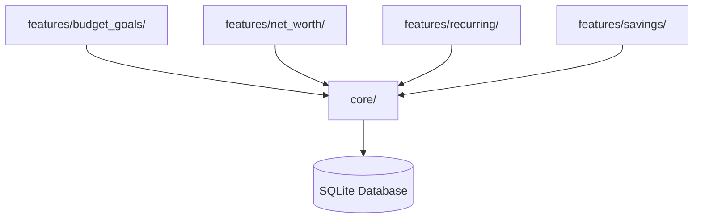

# Vertical Slices Architecture Migration

## Motivation

Budget Analyser started as a lightweight tool to combine bank statements and show reports. It has grown into a full personal finance suite (87+ files, 18,500+ LOC, 814 functions) with forecasting, net worth tracking, budget goals, payment reconciliation, and more.

The original **horizontal layered** architecture (views / controllers / domain / infrastructure) made it hard to reason about individual features since each one was scattered across 4+ directories. A single feature change (e.g., budget goals) required touching files in `views/pages/`, `controller/`, `domain/`, and `infrastructure/` simultaneously.

### Goals

- **Feature cohesion**: Each feature owns all its layers in a single directory
- **Independent testability**: Features can be tested in isolation with their own unit tests
- **Incremental migration**: Migrate one feature at a time without breaking existing code
- **Reduced coupling**: Features depend on shared `core/` but not on each other's internals

---

## Target Architecture

```
src/budget_analyser/
├── core/                       # Shared foundation
│   ├── protocols.py            # Domain interfaces
│   ├── errors.py               # Common exceptions
│   ├── database.py             # SQLite connection factory
│   └── models.py               # Cross-feature DTOs (MonthlyReports)
│
├── features/                   # Vertical feature slices
│   ├── budget_goals/           # COMPLETE (Phase 1 pilot)
│   ├── net_worth/              # Planned (Phase 3)
│   ├── recurring/              # Planned (Phase 3)
│   ├── savings/                # Planned (Phase 3)
│   ├── ingestion/              # Planned (Phase 3)
│   ├── mappers/                # Planned (Phase 3)
│   ├── reporting/              # Planned (Phase 3)
│   ├── payments/               # Planned (Phase 3)
│   ├── forecasting/            # Planned (Phase 3)
│   ├── trends/                 # Planned (Phase 3)
│   ├── export/                 # Planned (Phase 3)
│   └── settings/               # Planned (Phase 3)
│
├── views/                      # Shared view infrastructure
│   ├── app_gui.py              # Composition root
│   ├── dashboard_window.py     # Main shell
│   ├── pages/                  # Legacy pages (shrinking)
│   └── widgets/                # Shared reusable UI components
│
├── controller/                 # Legacy controllers (shrinking)
├── domain/                     # Legacy domain services (shrinking)
├── infrastructure/             # Legacy persistence (shrinking)
└── settings/                   # App configuration
```

### Slice Structure (Per Feature)

Each vertical slice follows this consistent structure:

```
features/<name>/
├── __init__.py         # Public API exports
├── models.py           # DTOs (dataclasses)
├── repository.py       # Database CRUD (uses core.database)
├── service.py          # Pure business logic (no PySide6, no infrastructure)
├── controller.py       # Thin facade: delegates to repository + service
└── page.py             # Qt widget (optional, only if feature has a UI page)
```

### Cross-Feature Dependencies

Features depend on `core/` for shared infrastructure, not on each other:



The composition root (`app_gui.py`) passes shared data like `MonthlyReports` to features that need it.

---

## Migration Pattern

### Step-by-Step Process

For each feature to migrate:

1. **Create feature DTOs** in `features/<name>/models.py`
2. **Extract DB operations** to `features/<name>/repository.py` using `core.database.get_connection()`
3. **Extract pure business logic** to `features/<name>/service.py`
4. **Create thin controller** in `features/<name>/controller.py` delegating to repo + service
5. **Move page view** to `features/<name>/page.py` (update imports)
6. **Leave backward-compat shims** in old locations (re-exports)
7. **Wire in composition root** (`app_gui.py`)
8. **Add unit tests** for service, repository, and controller
9. **Remove shims** once all consumers migrate

### Backward Compatibility

During migration, old import paths continue to work via re-export shims:

```python
# domain/errors.py (temporary shim)
from budget_analyser.core.errors import (  # noqa: F401
    DomainError, ValidationError, MappingNotFoundError, DataSourceError,
)

# domain/protocols.py (temporary shim)
from budget_analyser.core.protocols import (  # noqa: F401
    StatementRepository, ColumnMappingProvider, CategoryMappingProvider,
)

# controller/monthly_reports.py (temporary shim)
from budget_analyser.core.models import MonthlyReports  # noqa: F401

# views/pages/__init__.py (lazy import for BudgetGoalsPage)
def __getattr__(name):
    if name == "BudgetGoalsPage":
        from budget_analyser.features.budget_goals.page import BudgetGoalsPage
        return BudgetGoalsPage
    raise AttributeError(...)
```

Shims are removed once all consumers migrate to the new import paths.

---

## Phase Status

### Phase 1: Core Module + Pilot Feature (COMPLETE)

Created the shared `core/` module and migrated `budget_goals` as the pilot vertical slice.

| Task | Status | Details |
|------|--------|---------|
| Create `core/protocols.py` | Done | 3 Protocol interfaces moved from `domain/protocols.py` |
| Create `core/errors.py` | Done | 4 exception types moved from `domain/errors.py` |
| Create `core/database.py` | Done | `get_connection()` SQLite factory |
| Create `core/models.py` | Done | `MonthlyReports` frozen dataclass moved from `controller/monthly_reports.py` |
| Create `features/budget_goals/models.py` | Done | `BudgetGoal`, `EarningsGoal`, `BudgetProgress` DTOs |
| Create `features/budget_goals/repository.py` | Done | `BudgetGoalsRepository` — full CRUD for budget_goals + earnings_goals tables |
| Create `features/budget_goals/service.py` | Done | `calculate_budget_progress()`, `build_earnings_goal_map()` pure functions |
| Create `features/budget_goals/controller.py` | Done | `BudgetGoalsController` — thin facade |
| Move `features/budget_goals/page.py` | Done | `BudgetGoalsPage` moved from `views/pages/budget_goals_page.py` |
| Backward-compat shims | Done | `domain/errors.py`, `domain/protocols.py`, `controller/monthly_reports.py`, `controller/budget_controller.py`, `views/pages/__init__.py` |
| Unit tests | Done | 37 new tests across service (14), repository (16), controller (7) |
| Pylint clean | Done | 10/10 on non-view feature files |

**Verification:**
- 328/329 unit tests pass (1 pre-existing pandas deprecation issue)
- All import paths verified (new + backward-compat)
- No regressions in existing code

### Phase 2: Fix Architecture Violations (PLANNED)

| Issue | Fix | Status |
|-------|-----|--------|
| `domain/transaction_ingestion.py` imports `TransactionDatabase` | Add `TransactionRepository` protocol to `core/protocols.py`, inject via constructor | Planned |
| `budget_database.py` has `detect_recurring_transactions()` | Move to `features/recurring/service.py` when that feature migrates | Planned |

### Phase 3: Migrate Remaining Features (PLANNED)

Features ordered by dependency chain and complexity:

| Order | Feature | Source Files | Target | Complexity | Status |
|-------|---------|-------------|--------|------------|--------|
| 1 | `net_worth` | `BudgetController` (accounts section), `NetWorthPage`, `budget_database.py` (accounts table) | `features/net_worth/` | Low | Planned |
| 2 | `recurring` | `BudgetController` (recurring section), `RecurringPage`, `budget_database.py` (recurring table) | `features/recurring/` | Low | Planned |
| 3 | `savings` | `BudgetController` (savings section), `SavingsPage` | `features/savings/` | Low | Planned |
| 4 | `ingestion` | `transaction_ingestion.py`, `UploadController`, `UploadPage` | `features/ingestion/` | Medium | Planned |
| 5 | `mappers` | `MapperController`, `SubCategoryMapperController`, `CashflowMapperController`, mapper pages | `features/mappers/` | Medium | Planned |
| 6 | `reporting` | `reporting.py`, `EarningsStatsController`, `ExpensesStatsController`, Earnings/ExpensesPage | `features/reporting/` | Medium | Planned |
| 7 | `payments` | `payment_matching.py`, `PaymentsReconciliationController`, `PaymentsPage` | `features/payments/` | Low | Planned |
| 8 | `forecasting` | `forecasting.py` (standalone, no dedicated page yet) | `features/forecasting/` | Low | Planned |
| 9 | `trends` | `trend_analysis.py`, `spending_patterns.py` | `features/trends/` | Low | Planned |
| 10 | `export` | `export_service.py` | `features/export/` | Low | Planned |
| 11 | `settings` | `SettingsController`, `SettingsPage` | `features/settings/` | Low | Planned |

**Key milestones:**
- After orders 1-3: `BudgetController` and `BudgetDatabase` are fully decomposed and can be deleted
- After order 6: All stats controllers merged into `features/reporting/`
- After order 11: Legacy `controller/`, `domain/`, `infrastructure/` directories contain only cross-cutting infrastructure

---

## Design Decisions

### Database Strategy

All feature repositories operate on the **same SQLite database file** but own their own tables. The shared `core/database.py` provides a connection factory:

```python
# core/database.py
def get_connection(db_path: Path) -> sqlite3.Connection:
    """Create SQLite connection with row-factory enabled."""
    conn = sqlite3.connect(str(db_path))
    conn.row_factory = sqlite3.Row
    return conn
```

Each repository calls `get_connection()` and manages its own table creation in `_ensure_tables_exist()`.

### Service Layer Pattern

Feature services contain **pure functions** with no PySide6 or infrastructure dependencies:

```python
# features/budget_goals/service.py
def calculate_budget_progress(
    *, budgets: list[BudgetGoal],
    expenses_df: pd.DataFrame,
    year_month: str,
) -> list[BudgetProgress]:
    """Pure calculation — no DB access, no UI imports."""
```

This makes services trivially testable without mocks.

### Controller Thinness

Controllers are thin facades that:
1. Fetch data from the repository
2. Pass it to service functions for business logic
3. Return results to the view

They contain no business logic and no direct SQL.

### View Layer Exemptions

Page views (`page.py`) in feature slices remain exempted from pylint (like `views/pages/`), since Qt widget construction inherently violates many pylint rules (too-many-attributes, too-many-locals, etc.).

---

## Testing Strategy

Each feature slice gets three test files:

| Test File | What It Tests | Dependencies |
|-----------|---------------|--------------|
| `test_<feature>_service.py` | Pure functions with DataFrame fixtures | None (pure logic) |
| `test_<feature>_repository.py` | CRUD operations on temp SQLite via `tmp_path` | Real SQLite (temp) |
| `test_<feature>_controller.py` | Controller methods with real repo + service | Real SQLite (temp) |

**Conventions:**
- Use `pytest.approx()` for float comparisons
- Use `tmp_path` fixture for temporary SQLite databases
- Repository tests verify upsert, fallback, and delete-not-found edge cases

---

## Files Modified / Created

### New Files (Phase 1)

| File | Purpose |
|------|---------|
| `src/budget_analyser/core/__init__.py` | Core package init |
| `src/budget_analyser/core/protocols.py` | Domain interfaces |
| `src/budget_analyser/core/errors.py` | Domain exceptions |
| `src/budget_analyser/core/database.py` | SQLite connection factory |
| `src/budget_analyser/core/models.py` | `MonthlyReports` shared DTO |
| `src/budget_analyser/features/__init__.py` | Features package init |
| `src/budget_analyser/features/budget_goals/__init__.py` | Feature public API |
| `src/budget_analyser/features/budget_goals/models.py` | Budget goal DTOs |
| `src/budget_analyser/features/budget_goals/repository.py` | Budget goals SQLite CRUD |
| `src/budget_analyser/features/budget_goals/service.py` | Pure business logic |
| `src/budget_analyser/features/budget_goals/controller.py` | Thin facade controller |
| `src/budget_analyser/features/budget_goals/page.py` | Budget goals Qt page |
| `tests/unit/test_budget_goals_service.py` | Service function tests (14 tests) |
| `tests/unit/test_budget_goals_repository.py` | Repository CRUD tests (16 tests) |
| `tests/unit/test_budget_goals_controller.py` | Controller integration tests (7 tests) |

### Modified Files (Backward-Compat Shims)

| File | Change |
|------|--------|
| `src/budget_analyser/domain/errors.py` | Re-exports from `core.errors` |
| `src/budget_analyser/domain/protocols.py` | Re-exports from `core.protocols` |
| `src/budget_analyser/controller/monthly_reports.py` | Re-exports `MonthlyReports` from `core.models` |
| `src/budget_analyser/controller/budget_controller.py` | Facade: delegates budget/earnings goals to `features.budget_goals`; retains savings/net_worth/recurring |
| `src/budget_analyser/views/pages/__init__.py` | Lazy `__getattr__` import for `BudgetGoalsPage` |
| `src/budget_analyser/views/pages/budget_goals_page.py` | Lazy re-export shim |
